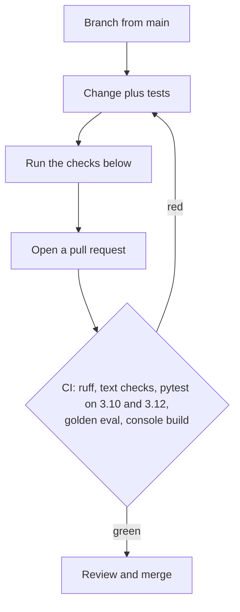

# Contributing

[](https://github.com/asadaslam556/agentic-rag-assistant/actions/workflows/ci.yml)
[](https://docs.astral.sh/ruff/)
[](tests)
[](#rules-that-keep-the-offline-guarantees)

Thanks for looking under the hood. I built this project framework-free on
purpose, so that every stage of the pipeline stays readable, and I'd like to
keep it that way. Issues and pull requests are welcome; I review them myself.

## Setup

```bash
python -m venv .venv && source .venv/bin/activate   # Windows: .venv\Scripts\Activate.ps1
pip install -e ".[dev]"
cd frontend && npm install && cd ..
```

## How a change gets in



## Before opening a pull request

```bash
pytest                     # the whole suite must pass
ruff check src tests       # zero findings
rag ingest data/sample_docs && rag eval   # golden set must stay at 11/11,
                                         # including expected tools
cd frontend && npm run build              # the console must build
python scripts/check_text.py              # style rules for text files
```

Behaviour changes come with tests. Retrieval, prompt, or verification changes
come with a look at `rag eval --judge` before and after. New answerable facts
belong in `data/sample_docs/` plus a golden case in `eval/golden_set.jsonl`.

## Style

- Python: ruff rules E, F, W, I, UP, B, line length 110. Optional dependencies
  are imported lazily so the offline core keeps working.
- Frontend: plain React and one stylesheet. No UI framework, no state library.
- Everywhere: no em dash characters, and no machine-specific paths.
  `python scripts/check_text.py` checks every tracked text file, and CI runs
  it on every push.
- The mock LLM contract is load-bearing (MODE markers, the observation format,
  END OF SOURCES, and the pipeline event names). Change those together with
  `llm/mock.py`, the tests, and the console, or CI will tell you.

## Rules that keep the offline guarantees

- `pytest` and `rag eval` pass with no network and no API keys. Optional
  dependencies (sentence-transformers, colpali, neo4j) are imported lazily,
  and fastapi stays out of `import agentic_rag`.
- `LLM_PROVIDER=auto` always falls back to the mock when Ollama is absent.
- The mock never decomposes a question, which keeps the eval deterministic.
- Tokenisation stays byte-identical on ASCII input.
- Anything shared across parallel branches needs a lock.
- `api.py` defines its request models at module scope. Moving them inside
  `create_app()` breaks FastAPI's annotation resolution and every POST
  returns 422.

[`docs/architecture.md`](docs/architecture.md) is the longer walkthrough of
the graph, the state design, and the concurrency work.
