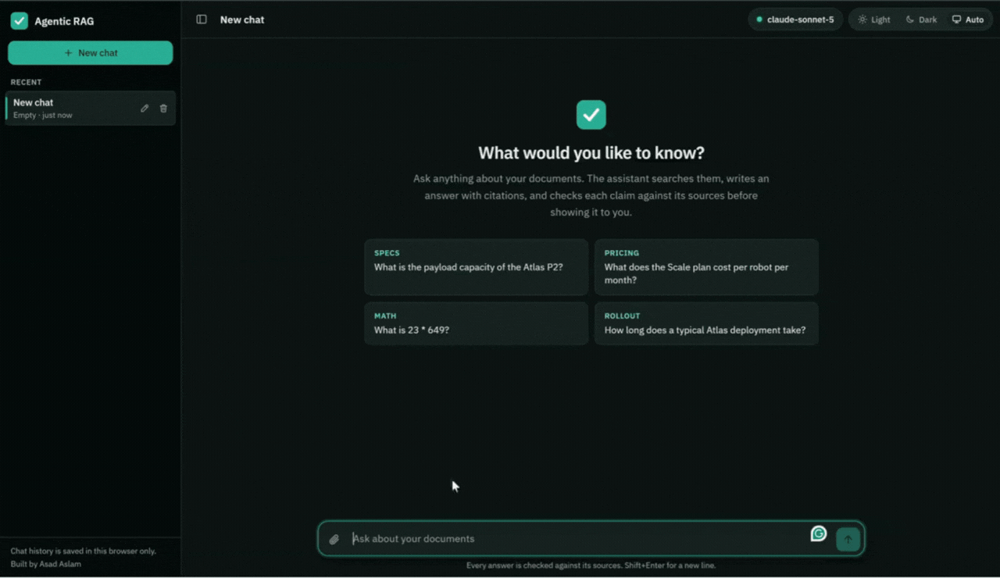
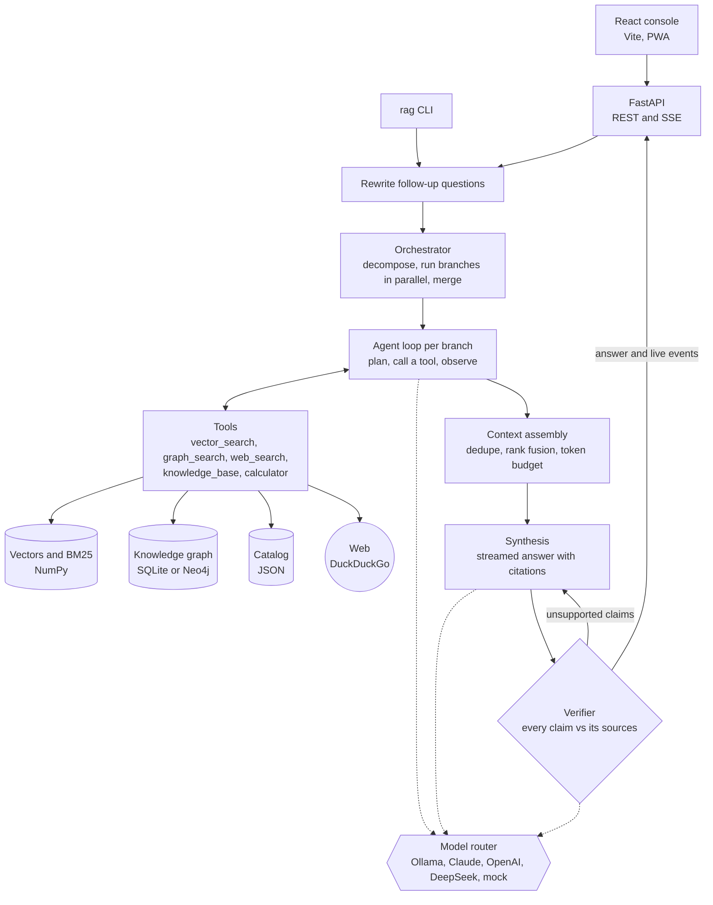
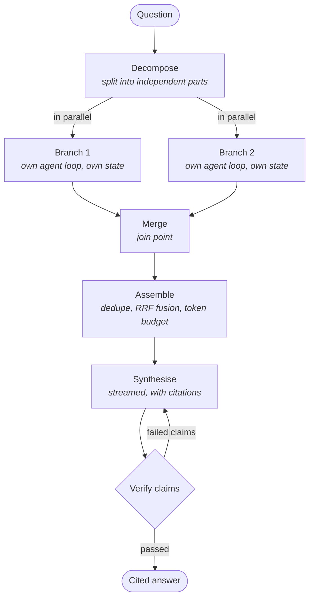
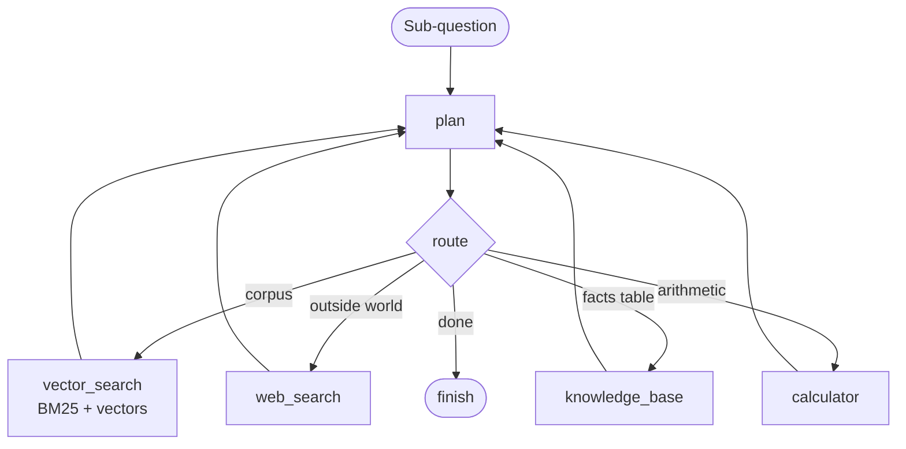
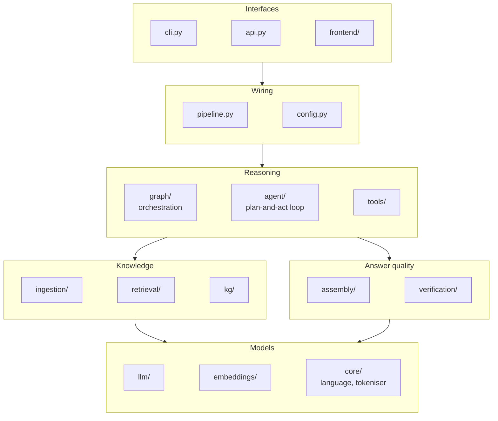
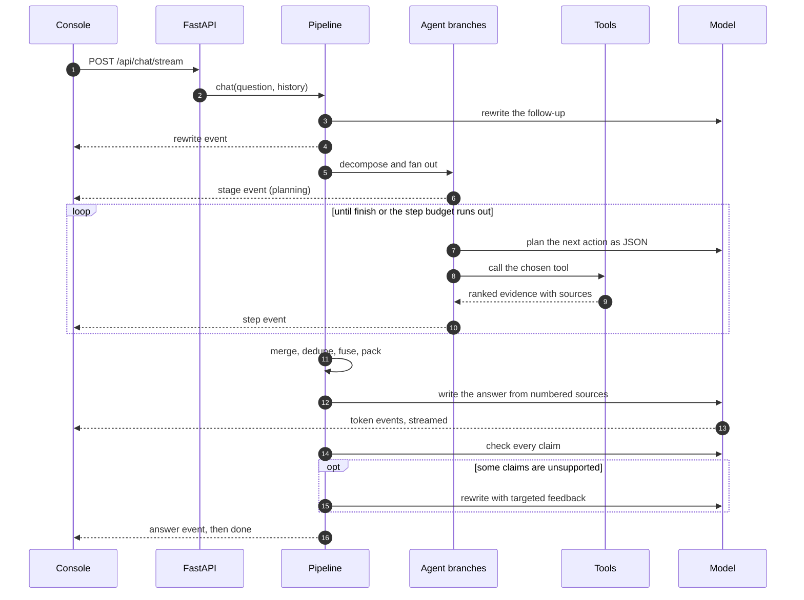
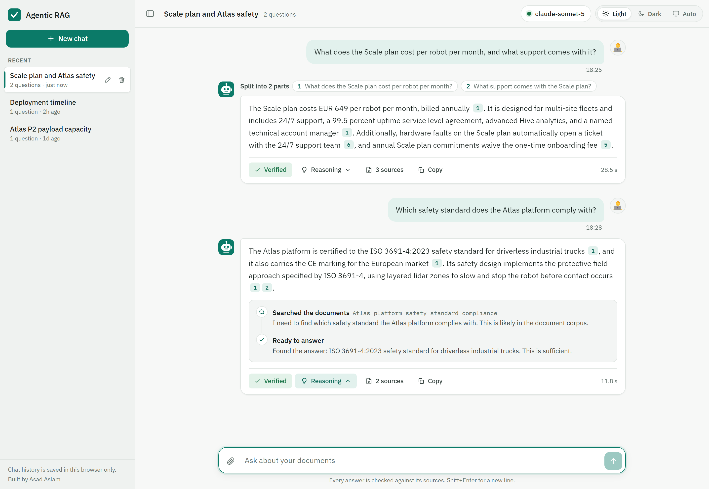

# Agentic RAG Knowledge Assistant

[](https://github.com/asadaslam556/agentic-rag-assistant/actions/workflows/ci.yml)
[](tests)
[](eval/golden_set.jsonl)
[](LICENSE)

**Backend**
[](https://www.python.org)
[](https://fastapi.tiangolo.com)
[](https://numpy.org)
[](https://docs.pydantic.dev)
[](https://docs.astral.sh/ruff/)
[](https://docs.pytest.org)

**Frontend**
[](https://react.dev)
[](https://vitejs.dev)
[](frontend/public/manifest.webmanifest)

**Models and retrieval**
[](https://ollama.com)
[](https://www.anthropic.com)
[](https://platform.openai.com)
[](https://www.deepseek.com)
[](https://www.sbert.net)
[](#architecture)
[](#pdfs-that-carry-their-meaning-in-pictures)

**Storage**
[](#the-knowledge-graph)
[](#storage-and-operations)
[](https://duckduckgo.com)

**Runtime**
[](Dockerfile)
[](.github/workflows/ci.yml)
[](#interfaces)
[](#quick-start)

<p align="center">
  
</p>

<p align="center"><sub>Real run on Claude over the bundled sample documents: parallel sub-questions, follow-ups, knowledge graph traversal, the calculator, a German question, and an honest "not in the sources" at the end.</sub></p>

A retrieval-augmented assistant that does not just search and summarise. You chat with it: an agent decides which tools to call, researches the independent parts of a question at the same time, streams a cited answer token by token, then checks every claim against the sources before the turn is marked done. When the evidence is not there, it says so.

It runs on a free local model by default, on Claude, OpenAI, or DeepSeek with one environment variable, and with no model at all for development, because a deterministic offline mock keeps the whole pipeline, the test suite, and CI working with zero keys and zero network.

## Quick start

No API key, no model download. The offline mock answers until you connect a real model.

```bash
git clone https://github.com/asadaslam556/agentic-rag-assistant.git
cd agentic-rag-assistant
python -m venv .venv && source .venv/bin/activate   # Windows: .venv\Scripts\Activate.ps1
pip install -e ".[dev]"
rag ingest data/sample_docs
rag ask "What does the Scale plan cost per robot per month?" --trace
```

For the web console, build it once and serve it together with the API on one port:

```bash
cd frontend && npm install && npm run build && cd ..
rag serve        # http://localhost:8000
```

Or run everything in Docker with `docker compose up --build`. The [setup guide](docs/setup-guide.md) walks through it step by step, and [`docs/commands.md`](docs/commands.md) is the Windows-first command reference, including cache clearing and a full reset.

## Contents

[Quick start](#quick-start) · [What it does](#what-it-does) · [Architecture](#architecture) · [The layers](#the-layers) · [Choosing a model](#choosing-a-model) · [The console](#the-console) · [PDFs](#pdfs-that-carry-their-meaning-in-pictures) · [Evaluation](#evaluation) · [Configuration](#configuration) · [Knowledge graph](#the-knowledge-graph) · [Languages](#languages) · [Docker](#docker) · [Deployment](#deployment-and-mobile) · [Design decisions](#design-decisions)

## What it does

- **Plans its own tool use.** Corpus search, knowledge graph traversal, web search, a structured catalog, and a calculator, chosen per question through a strict JSON protocol.
- **Runs in parallel.** A question with independent parts is split into sub-questions, each researched by its own agent loop on its own thread, then merged.
- **Retrieves hybrid.** BM25 keyword scores fused with vector similarity through reciprocal rank fusion.
- **Verifies before answering.** Every claim is checked against the sources it cites, with a refine loop and an honest abstention when the evidence is missing.
- **Streams live.** Stages, tool calls, and answer tokens arrive over server-sent events, so you watch the agent work.
- **Remembers.** Multi-turn chat with follow-up rewriting, and a browser-side history of conversations.
- **Takes your documents.** Drop pdf, md, txt, or html into the console and they are indexed immediately. PDF pages whose charts and tables text extraction would miss can be read as images by a vision model.
- **Routes models by job.** A cheap model plans, splits, and judges. A stronger one writes and verifies. Both come from `.env`.
- **Measures itself.** A golden set scores answer correctness, citation coverage, and tool correctness, with an LLM judge for faithfulness and relevance.
- **Installs like an app.** The console is a PWA and is built for phones as well as desktops.

## Why graph retrieval, in 30 seconds

The corpus says the Atlas P2 is made by Auralis Dynamics, that Auralis Dynamics is in Munich, and that the Atlas platform is certified to ISO 3691-4:2023. Three documents, three facts, no passage holding more than one of them. Ask which standard applies to the robot from the Munich company and similarity search has nothing to rank, because nothing looks like the question.

```
$ rag graph explain "Which safety standard applies to the robot made by the company headquartered in Munich?" --hops 3

SEEDS
  Munich (LOCATION)

PATH (3 hop max)
  hop 1: Auralis Dynamics -[LOCATED_IN]-> Munich
  hop 2: Atlas P2 -[MADE_BY]-> Auralis Dynamics
  hop 3: Atlas P2 -[COMPLIES_WITH]-> ISO 3691-4:2023
```

Two questions where the two paths actually differ, comparing what each one retrieved:

| Question | Looking for | Traversal | Similarity |
|---|---|---|---|
| Where is the company that makes the Atlas P2 headquartered? | Munich | HIT | MISS |
| Who makes the robot that complies with ISO 3691-4:2023? | Auralis Dynamics | HIT | MISS |

The comparison is at the retrieval level on purpose. Offline, the mock LLM answers by quoting whichever retrieved sentence overlaps the question most, so the wording of an answer says as much about the mock as about the retriever. What each path fetched is the honest measure. Reproduce it with `tests/test_knowledge_graph.py::test_traversal_retrieves_answers_similarity_search_misses`.

Not every relational question needs this. "Which safety standard does the Atlas platform comply with?" is one fact in one passage, and stays on `vector_search`.

## Architecture

### The whole system on one page



Solid arrows are data, dotted arrows are model calls. Every model call goes through the router, so each role can use a different model, and the offline mock stands in for all of them in tests and CI.

### Two nested levels

Both plain Python, no agent framework.

The **orchestrator** works out how many independent sub-questions a request really contains, runs a worker for each at the same time, merges what they found, and hands the result to synthesis and verification.



Each **worker** is the plan-and-act loop, scoped to one sub-question. Tool edges always return to the planner, which is what lets a branch notice that the corpus answered half the question and the web is needed for the rest, or see an error and route around it.



"What does the Scale plan cost **and** how long does deployment take" becomes two branches running concurrently. "What does the Scale plan cost?" stays a single branch and behaves exactly like the original loop, same events in the same order. The extra machinery only appears when the question genuinely has independent parts.

Two things fall out of splitting the levels. Independent parts get researched at the same time instead of one after another, which is what you feel with a slow local model. And the verifier grades the merged result, rather than the same planner that did the work marking its own homework.

[`docs/architecture.md`](docs/architecture.md) covers the state design, the shared step budget, the concurrency work, and the trade-offs in full.

## The layers



Each layer only calls the layers below it. Interfaces never touch retrieval directly, and nothing below `pipeline.py` knows whether a question came from the CLI, the API, or a test.

| Layer | Package | What it owns |
| --- | --- | --- |
| Interfaces | `cli.py`, `api.py`, `frontend/` | The command line, the REST and SSE API, the web console |
| Orchestration | `graph/` | Decomposition, parallel branches, shared budget, merge, coverage |
| Agent | `agent/` | The plan-and-act loop, the JSON protocol, prompts, a tolerant parser |
| Tools | `tools/` | vector_search, graph_search, visual_search, web_search, knowledge_base, calculator |
| Knowledge graph | `kg/` | Entity and relation extraction, SQLite or Neo4j store, multi-hop traversal |
| Retrieval | `retrieval/` | NumPy vector store, BM25, hybrid RRF fusion, page-image late interaction |
| Ingestion | `ingestion/` | Loaders for txt, md, html, pdf, and two chunking strategies |
| Assembly | `assembly/` | Dedupe, cross-tool fusion, re-scoring, token-budget packing |
| Verification | `verification/` | Claim splitting, groundedness, refine feedback, the eval judge |
| Models | `llm/`, `embeddings/` | Provider registry, per-role model router, embedder registry |
| Config | `config.py` | One dataclass, every setting, read from the environment |

Everything flows through `pipeline.py`, which is the best file to read first.

### How a question travels



1. **Remember.** In a conversation, "and what does it cost?" is rewritten into a standalone question using recent turns.
2. **Decompose.** The orchestrator decides how many independent sub-questions there are. Usually one.
3. **Plan and act.** Each branch runs its own loop: the model picks a tool, the tool returns evidence with a rank and a source reference, the observation goes back to the planner. Failures become observations rather than crashes.
4. **Merge and assemble.** Branch evidence is joined, deduplicated by text hash, fused with RRF across tools, re-scored against the question, and packed into a token budget. The packed order defines the citation numbers.
5. **Synthesise.** The model writes the answer using only the numbered sources, citing as [1] or [2][3]. Tokens stream out as they are produced.
6. **Verify.** The answer is split into claims, each checked against the sources it cites, lexically offline and with a dedicated model call when one is available.
7. **Refine or abstain.** Failed claims go back to synthesis with targeted feedback. If the sources do not contain the answer, the assistant returns an explicit insufficient-evidence response, and the verifier treats that honesty as a pass.

## Choosing a model

One variable switches the backend, and the pipeline is identical across all of them.

**Local and free (the default).** Install [Ollama](https://ollama.com/download), then:

```bash
ollama pull qwen2.5:7b-instruct
```

That is the whole setup. `LLM_PROVIDER=auto` probes `localhost:11434`, picks the most capable installed model, and falls back to the offline mock when Ollama is not running.

**Claude:**

```bash
LLM_PROVIDER=anthropic
ANTHROPIC_API_KEY=sk-ant-...
LLM_MODEL=claude-sonnet-4-6
```

**DeepSeek:**

```bash
LLM_PROVIDER=deepseek
DEEPSEEK_API_KEY=sk-...
LLM_MODEL=deepseek-flash
```

**OpenAI:**

```bash
LLM_PROVIDER=openai
OPENAI_API_KEY=sk-...
LLM_MODEL=gpt-4o-mini
```

### One model, or one per job

A run uses the model in several distinct roles. Planning tool calls, splitting a question, rewriting a follow-up, and scoring an eval are mechanical. Writing the answer and checking its claims are where quality shows. Set both tiers and each role goes to the right one:

```bash
LLM_MODEL_FAST=deepseek-flash        # plan, decompose, rewrite, judge
LLM_MODEL_DEEP=deepseek-v4-pro    # synthesize, verify, vision
```

Leave them unset and every role uses `LLM_MODEL`, exactly as before. Any single role can be pinned, which beats both tiers:

```bash
LLM_MODEL_JUDGE=some-cheap-model
```

`rag stats` prints the resolved map whenever more than one model is in play, and `/api/health` reports it too. Nothing about the routing is hardcoded: the roles are `plan`, `decompose`, `rewrite`, `synthesize`, `verify`, `judge`, and `vision`, and each reads `LLM_MODEL_<ROLE>` from the environment.

`ANTHROPIC_BASE_URL` and `OPENAI_BASE_URL` point either provider at a private or self-hosted endpoint, which also covers LM Studio, vLLM, and gateways. Two things worth knowing there:

- **Model names can differ from the public ones.** An endpoint might serve `claude-sonnet-4-6@default` where the public API calls it `claude-sonnet-4-6`. `rag models` asks your endpoint what it serves and flags whether your `LLM_MODEL` is on the list. Whatever you set is sent through untouched.
- **Some models reject `temperature` outright.** Set `LLM_TEMPERATURE=` (blank) to leave the field out of the request entirely.

Setup failures come back as readable advice rather than stack traces: a missing key, a rejected credential, a model the endpoint does not have. Adding a provider is one registered builder function in `src/agentic_rag/llm/providers.py`.

## The console

```bash
cd frontend
npm install
npm run dev        # console on :5173, proxies /api to :8000
```

Run `rag serve` alongside it. For one port, `npm run build` once and `rag serve` hosts the console and the API together on :8000.

<picture>
  <source media="(prefers-color-scheme: dark)" srcset="docs/dashboard.png">
  
</picture>

- **Conversations** in a sidebar you can rename, delete, and hide. The sidebar toggle remembers its state on desktop and turns into a slide-over drawer on phones. History stays in the browser; nothing is sent to a server.
- **Chat thread** with a live view while the agent works: the current stage, each tool call as it happens, and the answer growing token by token.
- **Every answer carries its verdict**: verified, or how many of its claims held up ("4 of 5 claims verified").
- **Reasoning on demand.** A toggle under each answer lists the steps the agent took, what it searched for, and why.
- **Evidence drawer** behind each answer: the verification report with a verdict per claim, the cited passages, the retrieved passages the answer didn't use, and the full agent trace with stage timings. Parallel branches are labelled by part.
- **Citations are clickable.** They open the drawer and highlight the exact source passage.
- **Status button** in the header. A green dot and the model name when everything is up, "Demo mode" when the offline mock is answering, "Offline" when the backend is gone. Click it for the details: model, index size, retrieval mode, version, and any component that is down.
- **Light, Dark, and Auto themes.** Auto follows the operating system.
- **Upload** pdf, md, txt, or html with the paperclip button in the composer.
- **Export** any answer as JSON: text, citations, verification report, trace.
- **Built for phones**: the evidence panel becomes a full-screen sheet, and the whole thing installs to a home screen.

Plain React and one stylesheet, no UI framework and no component library, so the console stays as readable as the backend.

## PDFs that carry their meaning in pictures

Text extraction gets the prose and loses the rest. A bar chart, a schematic, or a table whose layout is the information all come out as fragments or nothing at all, and for datasheets, reports, and slide decks that is often the half you wanted.

The repository ships a document to prove the point. `data/sample_pdfs/auralis-quarterly-review.pdf` has five pages: prose, a bar chart with **no printed values**, a table, a schematic, and an unlabelled trend line. Extract its text and the quarterly figures are simply not there, because they only exist as bar heights. A test asserts exactly that, so the demo cannot quietly stop being a demo.

Next to it are the Universal Declaration of Human Rights in German and Chinese, which give the multilingual retrieval something real to work on. Two cases in the multilingual eval set ask about public investor documents that are not redistributed here: the SAP Q1 2024 quarterly statement and the Siemens Healthineers Q3 FY2026 earnings release. Download them from the companies' investor relations pages into `data/sample_pdfs/` to run those cases.

Drop your own PDFs into `data/sample_pdfs/` and pick them up with `rag ingest data/sample_pdfs`. Discovery walks the folder and its subfolders, so nothing needs registering anywhere. Use `rag ingest` for new files; `rag reindex` only rebuilds what is already stored and will not notice a new document.

A PDF that is scanned or holds its content in pictures extracts no text and contributes nothing to the index. That is what `PDF_VISION` and the `vision` extra are for, described below.

```bash
rag ingest data/sample_pdfs
rag ask "How many robots were deployed by the end of Q4?" --trace
```

Two independent things can use page images, and both are off by default.

### Reading pages (`PDF_VISION`)

Each page is rendered and read by a vision-capable model, and the description is indexed as ordinary text. The chart becomes findable through the same hybrid search as everything else and cites as "page 2 (visual)".

```bash
pip install -e ".[vision]"      # adds the page renderer
PDF_VISION=auto                 # off | auto | on
```

`auto` only spends a model call when text extraction came back thin, which is the scanned or figure-heavy case where it pays.

### Retrieving pages as pictures (`VISUAL_RETRIEVER`)

This is the ColPali path. Page images are embedded directly, one vector per image patch, and ranked by late interaction (MaxSim): for every query token, take its best-matching patch and sum. A chart is matched as a chart, with no description standing in between.

```bash
pip install -e ".[colpali]"     # adds colpali-engine and torch
VISUAL_RETRIEVER=colpali
COLPALI_MODEL=vidore/colSmol-256M
```

That registers a `visual_search` tool the agent can choose, alongside corpus search and the rest. When a retrieved page reaches synthesis and the answering model can see, **the page image itself is attached to the prompt**, so the model reads the actual chart rather than a paraphrase of it.

### Which one to use

| | `PDF_VISION` descriptions | `VISUAL_RETRIEVER=colpali` |
| --- | --- | --- |
| Extra install | page renderer, small | colpali-engine and torch, large |
| Hardware | none | CPU works with colSmol, GPU for the bigger models |
| Retrieval quality on charts | good, limited by the description | better, nothing is paraphrased away |
| Cost | one model call per page at ingest | one forward pass per page, then per query |
| Runs on a free hosting tier | yes | no |

The honest summary: ColPali is the stronger retriever and the reason to want it is real. It is also a 256M to 3B vision model plus torch, which does not fit in 512 MB of free-tier memory, so a free-tier deployment runs the description path while a local install can run either. Both write into the same page index and both feed the same `visual_search` tool, so switching is one environment variable.

## Real output

```text
-- ANSWER --------------------------------------------------------------
Scale plan cost: EUR 649 per robot per month, billed annually. [1]

-- VERIFICATION --------------------------------------------------------
  PASSED  groundedness 100%  citation coverage 100%  method lexical

-- AGENT TRACE ---------------------------------------------------------
  1. knowledge_base {"query": "What does the Scale plan cost per robot per month?"}
     thought: Pricing or catalog data lives in the structured knowledge base.
  2. vector_search {"query": "What does the Scale plan cost per robot per month?"}
     thought: Cross-check the structured record against the document corpus.
  3. finish {}
```

## Evaluation

`rag eval` runs a golden set covering document facts, structured lookups, arithmetic routing, and multi-fact answers. Each case declares a category, a difficulty, and the tools it should trigger, so the run scores three things: did the answer contain the fact, did it cite anything, and did the agent reach for the right tools. `--judge` adds graded faithfulness and relevance, from a dedicated judge call with a real model and a deterministic lexical scorer offline.

```text
  answer correctness: 8/8
  answers with citations: 8/8
  average groundedness: 100%
  average latency: 2 ms
  expected tools called: 8/8

  by category
    calculation          1/1
    document-fact        4/4
    multi-fact           1/1
    structured-lookup    2/2
  average faithfulness (judge): 100%
  average relevance (judge): 85%
```

The 85% relevance is the honest reading of extractive answers: they carry supporting detail beyond the literal question words, and the lexical scorer counts that against them. The eval exits non-zero on any regression, and CI runs it on every push next to ruff, the 236-test suite on two Python versions, and a full console build, all without secrets.

The default golden set covers the English sample documents, which is what CI runs. `eval/golden_set_multilingual.jsonl` covers the expanded corpus with German, Arabic, Chinese, and English questions, and needs the PDFs and multilingual documents ingested first:

```bash
rag ingest data/sample_docs
rag ingest data/sample_docs_multilingual
rag ingest data/sample_pdfs
rag eval --golden eval/golden_set_multilingual.jsonl
```

## Configuration

Copy `.env.example` to `.env`. Every setting is documented there.

| Setting | Values | Notes |
| --- | --- | --- |
| `LLM_PROVIDER` | `auto`, `ollama`, `anthropic`, `deepseek`, `openai`, `azure`, `openai_compatible`, `mock` | `auto` uses Ollama when running, else the mock |
| `LLM_MODEL` | any model name | One name for whichever provider is active, sent untouched |
| `LLM_MODEL_FAST` / `LLM_MODEL_DEEP` | model names | Optional two-tier routing by role |
| `LLM_MODEL_<ROLE>` | model name | Pins one role, beats the tiers |
| `LLM_TEMPERATURE` | float or blank | `0.1` by default. Verifier, judge, and decomposer always run at `0.0` |
| `ANTHROPIC_BASE_URL` / `OPENAI_BASE_URL` | URL | Private, self-hosted, or gateway endpoints |
| `RETRIEVAL_MODE` | `hybrid`, `vector`, `bm25` | `hybrid` fuses BM25 and vector rankings with RRF |
| `CHUNK_STRATEGY` | `structure`, `length` | Structure keeps headings and sentences intact, length is a fixed window |
| `PDF_VISION` | `off`, `auto`, `on` | Read PDF pages as images so charts and tables are indexed |
| `VISUAL_RETRIEVER` | `description`, `colpali` | How indexed pages are ranked |
| `COLPALI_MODEL` | model id | Blank uses colSmol, the CPU-friendly member of the family |
| `VISION_MAX_PAGES` / `VISION_SCALE` | int, float | Page cap and render resolution |
| `MAX_BRANCHES` | int | Parallel sub-questions allowed, `1` disables splitting |
| `MAX_TOTAL_AGENT_STEPS` | int | Tool calls across all branches of one question |
| `EMBEDDINGS_PROVIDER` | `local`, `sbert`, `multilingual`, `openai` | `local` is a hashed TF embedder, fine for the demo |
| `MULTILINGUAL_EMBEDDING_MODEL` | model id | Used by `multilingual`, defaults to `intfloat/multilingual-e5-small` |
| `ANSWER_LANGUAGE` | `auto` or a code | `auto` answers in the language of the question |
| `SEARCH_PROVIDER` | `ddgs`, `tavily`, `fixture`, `none` | `ddgs` is keyless DuckDuckGo |
| `VERIFIER_MODE` | `auto`, `lexical`, `llm` | `auto` picks lexical for the mock, model verification otherwise |
| `API_AUTH_TOKEN` | string | Empty keeps the local API open, set it before exposing the server |
| `UPLOAD_MAX_MB` | int | Per-file cap for console uploads |
| `INGEST_ROOTS` | folders | Where `/api/ingest` may read, default `data`. The CLI is not limited |

Switching embedders invalidates the index on purpose: the store records which embedder built it and refuses mixed vectors. Run `rag reindex` to rebuild from the chunks already stored, or `rag reset --yes` and re-ingest from the source files.

## Connecting a real model

The project runs offline out of the box: with nothing configured, `LLM_PROVIDER=auto` looks for a local Ollama and falls back to the deterministic mock, so there is never a key to find before the first run.

To use Claude, put the values in `.env` (which is gitignored, and `.env.example` has the placeholders) or export them:

```bash
LLM_PROVIDER=anthropic
ANTHROPIC_API_KEY=sk-ant-...
ANTHROPIC_MODEL=claude-sonnet-5@default    # whatever your endpoint serves
ANTHROPIC_BASE_URL=https://api.anthropic.com
```

`ANTHROPIC_BASE_URL` points at a private or self-hosted endpoint instead of the public API. Model names often differ between the two, so the string in `ANTHROPIC_MODEL` is passed through untouched and `rag models` asks the endpoint what it serves.

DeepSeek speaks the OpenAI chat format, so it runs through the same client:

```bash
LLM_PROVIDER=deepseek
DEEPSEEK_API_KEY=sk-...
DEEPSEEK_MODEL=deepseek-flash
```

Keys are only ever read from the environment or `.env`. A missing one is reported as a setup problem with the variable named, not a stack trace:

```
Configuration error: LLM_PROVIDER=anthropic requires ANTHROPIC_API_KEY.
Put it in .env (see .env.example) or export it in your shell.
```

Adding another backend means one builder function in `llm/providers.py` tagged with `@register("name")`, and nothing else.

### Checking the answer language against a real model

The offline suite cannot prove this part. The mock answers by quoting the sentences it retrieved, so it only shows that a German question routes to German evidence. Whether a real model obeys the answer-language rule needs a real model:

```bash
python scripts/smoke_language.py
```

It asks a German question end to end, prints the answer, and reports the language it came back in. Exit codes: 0 answered in German, 1 answered in another language, 2 the provider is not configured, 3 the index is empty.

## The knowledge graph

The orchestration graph already in the project decomposes a question and merges branches. This is a different thing: a graph of what the documents are *about*, so a question whose answer is not written in any single passage can be answered by following relationships instead of ranking similarity.

The case for it is narrow and real, and the [Munich example above](#why-graph-retrieval-in-30-seconds) is the whole argument: three facts in three passages, and a question only an explicit walk between them can answer.

### Schema

Five entity types and four edge types. Small on purpose: a schema an offline extractor can fill reliably and a reader can hold in their head.

| Entity type | Example |
|---|---|
| `COMPANY` | Auralis Dynamics, SAP |
| `PRODUCT` | Atlas P2, Atlas Hive |
| `PERSON` | Bernd Montag |
| `STANDARD` | ISO 3691-4:2023, GDPR, SOC 2 Type II |
| `LOCATION` | Munich, Walldorf |

| Edge | From | To |
|---|---|---|
| `MADE_BY` | PRODUCT | COMPANY |
| `SUPPLIES` | COMPANY | COMPANY, PRODUCT |
| `COMPLIES_WITH` | PRODUCT, COMPANY | STANDARD |
| `LOCATED_IN` | COMPANY, PERSON | LOCATION |

Edges are checked against those pairs, so a cue word cannot produce a location that complies with a standard.

### Extraction

Two extractors behind `GRAPH_EXTRACTOR`, registered the same way LLM providers are:

- `offline` (default) is patterns and rules. No key, no network, no cost. Standards come from their number format, companies from corporate suffixes, products from model codes, people from titles, locations from prepositions. Every edge needs a cue word between the two mentions.
- `llm` asks the configured provider for JSON per chunk and reads far more than patterns can. **It costs one model call per chunk.** The sample corpus is about 30 chunks; a few hundred PDF pages is a few hundred calls. An unparseable reply falls back to the offline rules for that chunk rather than losing it.

`auto`, the default, stays offline unless `LLM_PROVIDER` was set deliberately, so a plain `rag ingest` never starts spending money because Ollama happened to be running. Entities per chunk are capped by `GRAPH_MAX_ENTITIES_PER_CHUNK` (12).

Extraction runs on non-English chunks too. Standard numbers survive translation untouched, and the alias table carries product and company names across scripts. Surface forms are stored as they appeared: an Arabic chunk records `أطلس` while resolving to the same node as `Atlas P2`.

### Entity resolution, and what it does not do

Resolution is case and whitespace normalisation, Unicode NFKC, plus an exact-match alias table (`data/graph_aliases.json`, format `{"surface form": ["Canonical Name", "TYPE"]}`). That is all of it. Known limits, stated rather than papered over:

- No fuzzy or embedding-based matching. "Auralis Dynamic" and "Auralis Dynamics" stay two nodes unless an alias says otherwise.
- No coreference. "the company" in a later sentence links to nothing.
- No disambiguation. Two different companies with one name become one node.
- The offline extractor leans on capitalisation, so it is strongest on Latin script. Non-Latin chunks mostly yield standards and alias hits.

Aliases are the intended fix for all of these when a corpus needs it.

### graph_search and routing

`graph_search` sits alongside the existing tools. It links the question to seed entities, walks k hops, and returns the traversed path plus the chunks the walked edges came from, so answers stay grounded in and cited to source text.

The routing rule: **a question that names something by its relationship, or needs two or more facts chained, goes to `graph_search`; a single fact stated in one passage stays on `vector_search`.** "The company that makes X" is relational; "what is the payload capacity of X" is not. The tool is only offered once the graph actually holds edges, so the planner never sees a tool whose only answer is "nothing here".

Traversal is inspectable with `rag graph explain "<question>" --hops 3`, which prints the seed entities and every hop it walked, as in the [example at the top](#why-graph-retrieval-in-30-seconds).

### Storage and operations

SQLite by default, in `storage/index/graph.sqlite3` next to the vector index, so a fresh clone gets a working graph with no service to install. Writes are idempotent per document: re-ingesting replaces what that document contributed rather than doubling it.

An optional Neo4j backend is selected with `GRAPH_STORE=neo4j` and `pip install "agentic-rag-assistant[neo4j]"`. It is never required, and no test or default run touches it.

```bash
rag graph stats      # entity and relationship counts by type
rag graph rebuild    # rebuild from stored chunks, no source files needed
```

`rag graph rebuild` reads the chunk text the index already holds, the same way `rag reindex` does, so chunk ids stay stable and every edge keeps its evidence. Graph building never breaks document ingest: a chunk the extractor chokes on is skipped and counted, a failing document is reported, and the documents still land in the index. Rebuild is the recovery path.

```bash
rag eval --golden eval/golden_set_graph.jsonl
```

## Languages

Retrieval and answers work in languages other than English. English is still the default and behaves exactly as it did before.

- Tokenisation keeps letters from any script, so German umlauts survive instead of splitting words apart, and Arabic and Urdu produce real tokens instead of nothing. English output is byte-identical to the earlier ASCII-only rule, checked over the English corpus and 125k fuzz cases.

  | Input | ASCII-only rule | Now |
  |---|---|---|
  | `Die Weiße Straße hat große Türen` | `die, wei, stra, hat, gro, ren` | `weiße, straße, große, türen` |
  | `معيار السلامة` | (nothing) | `معيار, السلامة` |
- Chinese and Japanese have no spaces to split on, so runs of Han and kana are indexed as overlapping bigrams. Indexing and querying use the same rule, so the two sides match.
- Stopwords are picked per language. English, German, Arabic, Chinese, and Urdu ship with lists; anything else falls back to English.
- The language is detected from the script first, then from stopword hits when the script alone cannot decide, which is how Urdu is told apart from Arabic and German from English. Short queries with no signal, `Atlas P2` for instance, fall back to English.
- Answers come back in the language of the question. Mixed-language questions use whichever language they are mostly written in. `ANSWER_LANGUAGE` overrides this if you would rather pin one language.

For a corpus that is genuinely multilingual, the hashed local embedder only matches on shared tokens, so switch to a multilingual model:

```bash
pip install -e ".[multilingual]"           # sentence-transformers, about 470 MB of model on first run
export EMBEDDINGS_PROVIDER=multilingual    # or set it in .env
rag reindex                                # dimensions change, so rebuild
```

`rag reindex` re-embeds the chunks already in the store, so the original files do not need to be present, and chunk ids stay stable so citations still line up. There is a sample multilingual corpus in `data/sample_docs_multilingual/` (German, Arabic, Chinese, Urdu) to try it against.

## Project structure

```text
agentic-rag-assistant/
  src/agentic_rag/
    pipeline.py            # wires the whole flow; start here
    graph/                 # decompose, parallel branches, shared budget, merge
    agent/                 # plan-and-act loop, JSON protocol, prompts, parser
    tools/                 # vector_search, graph_search, visual_search, web_search, knowledge_base, calculator
    retrieval/             # NumPy vector store, BM25, hybrid RRF, late interaction, reindex
    kg/                    # knowledge graph: extraction, SQLite store, traversal
    ingestion/             # loaders, chunking strategies, PDF page-image reading
    assembly/              # dedupe, fusion, re-scoring, token packing
    verification/          # claim checks, refine feedback, eval judge
    llm/  embeddings/      # provider registry, model router, embedders
    cli.py  api.py         # command line, REST + SSE
  frontend/                # React console, PWA manifest and icons
  data/                    # sample corpus, structured catalog, and the demo PDF
  docs/                    # architecture, deployment, setup guide, command reference, screenshots
  eval/golden_set.jsonl    # regression questions with categories and expected tools
  scripts/                 # quickcheck, reindex, smoke_language, text check, icon and sample PDF generators
  tests/                   # 236 tests, offline by design
  .github/                 # CI, dependabot, templates
```

## Interfaces

```bash
rag serve --port 8000
curl -s localhost:8000/api/health
curl -s -X POST localhost:8000/api/chat -H "content-type: application/json" \
     -d '{"question": "How long does it run on a charge?", "history": []}'
```

`/api/health` reports per-component status, including a live probe of the model backend, and flips to `degraded` when anything is down, so it works as a real readiness check. `/api/chat/stream` takes the same body and answers with server-sent events. `/api/ask` remains for one-shot calls. With `API_AUTH_TOKEN` set, every endpoint except `/api/health` needs `Authorization: Bearer <token>`.

## Docker

```bash
docker compose up --build
```

One image with the console built in and the sample corpus pre-indexed, on port 8000. The index, graph, and uploads live in a named volume, so they survive rebuilds. Out of the box the container runs on the offline mock, because `.env` is kept out of the image on purpose. To use your own keys, uncomment `env_file` in `docker-compose.yml`; if your `.env` selects the multilingual embedder, set the `EXTRAS` build argument to `[multilingual]` too.

## Deployment and mobile

[`docs/deployment.md`](docs/deployment.md) covers both: viewing it on your phone in two minutes with a tunnel or a LAN address, and putting it online permanently. Short version: this is a long-running container with streaming and local state, so Render (free, no card) or Google Cloud Run (free quota, card required) fit, while Vercel does not, because serverless functions time out mid-stream and start with a cold filesystem. Two things to know before deploying: a private or internal model endpoint will not resolve from a public host, so use a provider key that works from anywhere, and Ollama cannot run on a free tier.

## Security

Local-first by default: no telemetry, and with Ollama nothing leaves your machine except the web searches the agent chooses to run. Before exposing the server, set `API_AUTH_TOKEN` and put TLS in front of it. Uploads are extension-whitelisted, size-capped, and filename-sanitised. Details and the reporting contact are in [`SECURITY.md`](SECURITY.md).

## Design decisions

**No agent framework.** The two-level graph, fusion logic, streaming, and verifier are about 4,000 lines of readable Python. For a system whose point is showing how agentic RAG works, a framework would hide the parts worth reading. The frontend follows the same rule.

**Local-first, cloud-optional.** Ollama is the default because it costs nothing and keeps data on your machine. The same interface covers Claude, OpenAI, Azure, and any compatible gateway, so switching is one variable, not a refactor.

**Hybrid retrieval, because embeddings miss exact terms.** An embedder can rank a paraphrase above the one chunk containing "ISO 3691-4". BM25 catches exact terms, vectors catch paraphrases, and RRF merges the rankings without calibrating their scores against each other.

**A strict JSON protocol, and a mock that speaks it.** The loop runs on a small JSON contract instead of provider-specific function calling, which is what makes a fully deterministic offline mock possible, and that is why the tests, the eval, the streaming events, and CI all run with no network and no keys.

**Isolated branch state.** Each branch owns its evidence, its steps, and its errors, and only a summary crosses back out. The step budget is the deliberate exception: one tracker shared by every branch, behind a lock, because `used += 1` is not atomic and parallel branches would otherwise overrun the cap.

**Verification is the feature.** Most RAG demos stop at "answer with sources". Here the answer is split into claims, each checked against what it cites, failed claims trigger a rewrite with targeted feedback, and unanswerable questions get an explicit abstention. Honesty is cheaper than a confident hallucination.

**Honest limitations.** Offline, the verifier and judge are lexical approximations, useful and deterministic but not semantic judges. Real models switch both to model-based checks. The hashed embedder is a demo device, use `sbert` for real semantic quality. The vector store is exact NumPy search, right up to tens of thousands of chunks and intentionally not a vector database. Follow-up rewriting and decomposition need a real model. And 7B-class instruct models handle the JSON tool loop well, tiny models sometimes do not.

## Development

```bash
pytest                  # 236 tests, all offline
ruff check src tests    # lint
rag eval                # golden set, non-zero exit on regression
rag eval --judge        # adds faithfulness and relevance
python scripts/quickcheck.py   # end-to-end sanity run without pytest
python scripts/check_text.py   # style rules for tracked text files
```

[`CONTRIBUTING.md`](CONTRIBUTING.md) has the pull request checklist and the rules that keep the offline guarantees intact. [`CHANGELOG.md`](CHANGELOG.md) records every release.

## Author

Built by [Asad Aslam](https://asadaslam.tech), data engineer in Nürnberg. [LinkedIn](https://linkedin.com/in/asadaslam556), [GitHub](https://github.com/asadaslam556).

MIT licensed. The sample corpus and its company are fictional. The UDHR translations are published by the United Nations.
