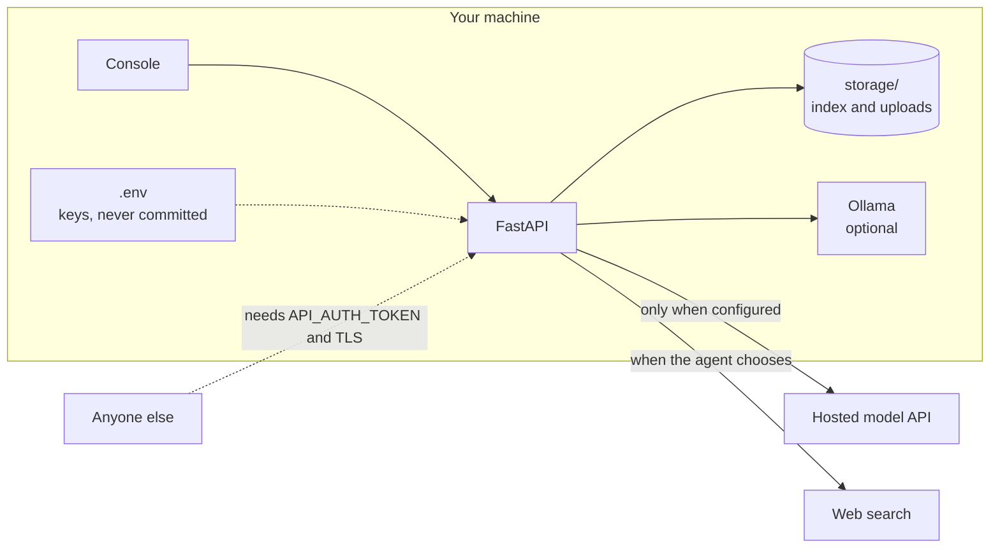

# Security

## Scope

This is a local-first tool. The default posture assumes the API and console
run on your own machine and are reachable only from localhost. Nothing phones
home: no telemetry, no analytics, and with Ollama plus the default settings,
no data leaves your computer except the web searches the agent chooses to run.

## Trust boundaries

## Before exposing the server

1. Set `API_AUTH_TOKEN` in `.env`. Every endpoint except `/api/health` then
   requires `Authorization: Bearer <token>`.
2. Terminate TLS in front of it (a reverse proxy such as Caddy or nginx).
3. Know the endpoint semantics: `/api/ingest` reads paths on the server
   machine by design and should never be reachable by untrusted clients even
   with a token. `/api/upload` is the remote-safe way to add documents. It
   accepts only the supported document extensions, sanitises filenames,
   enforces `UPLOAD_MAX_MB`, and stores files under `storage/uploads/`.
4. The calculator tool evaluates arithmetic through a restricted AST walker
   (numbers and arithmetic operators only, with size guards), not `eval`.

## Reporting

Please report suspected vulnerabilities privately through GitHub security
advisories on this repository, or by email to Asad Aslam at
asadaslam556@gmail.com. Include reproduction steps. I will reply within a few
days.
