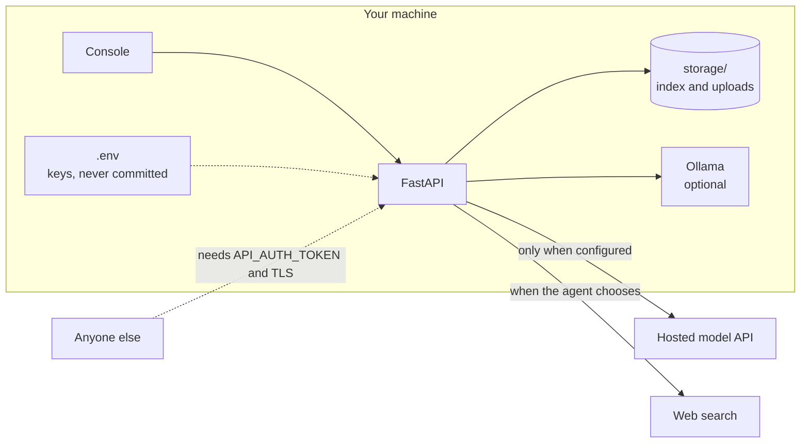

# Security

## Scope

This is a local-first tool. The default posture assumes the API and console
run on your own machine and are reachable only from localhost. Nothing phones
home: no telemetry, no analytics, and with Ollama plus the default settings,
no data leaves your computer except the web searches the agent chooses to run.

## Trust boundaries

## Before exposing the server

1. Set `API_AUTH_TOKEN` in `.env`. Every endpoint except `/api/health` then
   requires `Authorization: Bearer <token>`.
2. Terminate TLS in front of it (a reverse proxy such as Caddy or nginx).
3. Know the endpoint semantics: `/api/ingest` reads folders on the server
   machine, but only those listed in `INGEST_ROOTS` (default `data`) and the
   uploads folder. Paths are resolved first, so `..` and symlinks cannot
   climb out, and a forbidden path gets the same 404 as a missing one.
   `/api/upload` is the remote-safe way to add documents. It accepts only the
   supported document extensions, strips directory parts and unusual
   characters from file names, enforces `UPLOAD_MAX_MB`, and stores files
   under `storage/uploads/`.
4. Errors stay on the server. Unexpected exceptions are logged in full and
   the client gets a short, generic message, so stack details and file paths
   never leave the machine.
5. The calculator tool evaluates arithmetic through a restricted AST walker
   (numbers and arithmetic operators only, with size guards), not `eval`.

## Reporting

Please report suspected vulnerabilities privately through GitHub security
advisories on this repository, or by email to Asad Aslam at
asadaslam556@gmail.com. Include reproduction steps. I will reply within a few
days.
