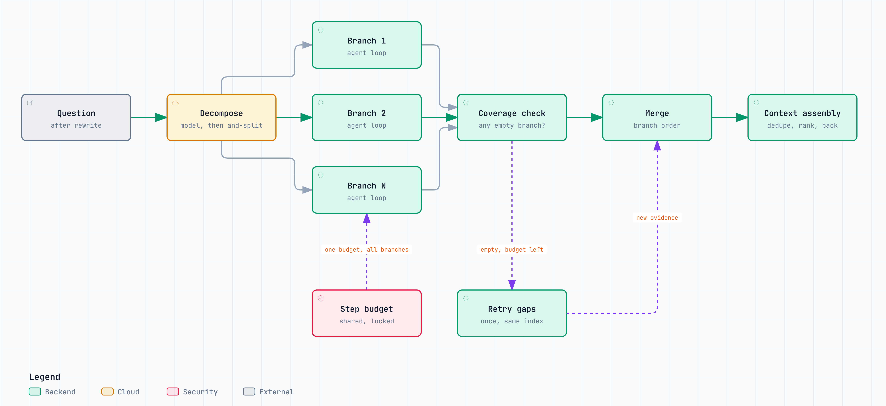

# The agent and the orchestrator

Retrieval runs as two nested state machines rather than one loop. Both are plain Python with no agent
framework, so the control flow stays visible and testable and the trace the console shows is the
literal execution path.

Code: `src/agentic_rag/agent/` (the worker loop) and `src/agentic_rag/graph/` (the orchestrator).
This is not `agentic_rag.kg`, which is the [knowledge graph](knowledge-graph.md).

## The worker: one agent loop per sub-question

<picture>
  <source media="(prefers-color-scheme: dark)" srcset="diagrams/agent-loop.architecture.dark.png">
  
</picture>

Interactive version: [`diagrams/agent-loop.architecture.html`](diagrams/agent-loop.architecture.html) (open it locally in a browser).

`Orchestrator.collect` in `agent/orchestrator.py` runs the loop:

1. **Take a step.** Each step claims one unit of the shared budget (`budget.take()`). When the budget is
   used up, the loop finishes with the evidence it has.
2. **Plan.** The model returns exactly one action as JSON: a tool call or `finish`. The protocol lives
   in `agent/prompts.py`, and `agent/parser.py` extracts the first JSON object even from a chatty
   reply.
3. **Guards.** A reply with no usable JSON gets a retry note, and three failures in a row end the loop.
   An unknown tool or a repeated identical call gets a corrective note instead of running.
4. **Run the tool.** `safe_run` turns any exception into an observation, so a failing tool never
   crashes the loop.
5. **Observe.** The observation passes through the [injection filter](../SECURITY.md) before the
   planner reads it, because the planner picks the next search from it.

Each branch runs at most `MAX_AGENT_STEPS` (6) steps. Tool results always come back to the planner,
which is what lets a branch notice that the corpus answered part of the question but the web is
needed for the rest, or see an error and route around it.

### The tools

| Tool | Module | Used for |
|---|---|---|
| `vector_search` | `tools/vector_search.py` | The document corpus, hybrid BM25 and vectors |
| `graph_search` | `tools/graph_search.py` | Questions that chain facts through relationships. Offered only once the graph holds edges |
| `visual_search` | `tools/visual_search.py` | PDF pages ranked as images. Offered only once pages are indexed |
| `web_search` | `tools/web_search.py` | The outside world, through `SEARCH_PROVIDER` |
| `knowledge_base` | `tools/structured.py` | The structured catalog (`data/structured/catalog.json`) |
| `sql_query` | `tools/sql.py` | Counts, totals, and rankings over records, see [Text-to-SQL](text-to-sql.md) |
| `calculator` | `tools/structured.py` | Arithmetic |

Adding a tool is described in `.claude/skills/add-agent-tool/`.

## The orchestrator: decompose, branch, check coverage, merge

<picture>
  <source media="(prefers-color-scheme: dark)" srcset="diagrams/orchestration.architecture.dark.png">
  
</picture>

Interactive version: [`diagrams/orchestration.architecture.html`](diagrams/orchestration.architecture.html).

`GraphRunner.run` in `graph/runner.py`:

1. **Decompose.** `graph/decompose.py` works out how many independent sub-questions the request
   contains, usually one.
2. **Branch.** Each sub-question runs its own worker loop. With more than one, they run on a thread
   pool of up to `MAX_BRANCHES` (3) workers.
3. **Coverage.** A branch that found nothing, and did not fail, gets one more try while the shared
   budget lasts. The retry keeps the branch index, so its steps are reported under the same part of
   the question. The console sees a `retrying` stage.
4. **Merge.** Evidence and steps are joined in branch order. Deduplication and ranking happen later,
   in [context assembly](retrieval.md).

A single sub-question runs inline on the calling thread and emits the same events in the same order
as the plain loop: `stage planning` first and no `decompose` event. Tests depend on that.

### The decomposer degrades in three layers

1. **Structured output.** The model returns `{"sub_questions": [...]}`, which is deduplicated and
   length-checked (8 to 300 characters each).
2. **A conservative split.** If that reply is unusable, the question is split on " and ", but only
   when both halves stand alone: each needs at least 20 characters and three content words. "When
   was the company founded and where?" stays one question.
3. **The original question.** If neither produces something usable, the request runs as one branch.

The mock provider never decomposes, which keeps offline runs, the golden-set eval, and CI
deterministic. `MAX_BRANCHES=1` turns splitting off.

### Why branches keep their own state

Each branch owns a `BranchState` (`graph/state.py`): its sub-question, its evidence, its steps, its
error. Nothing a branch does can reach another branch, which is what makes running them on threads
safe. One shared evidence list written by every branch would have them overwriting each other with
no exception, just a quietly wrong result.

Shared state is the deliberate exception, and each piece has a lock:

- **The step budget.** One `BudgetTracker` caps total tool calls across all branches at
  `MAX_TOTAL_AGENT_STEPS` (12). `self.used += 1` is not atomic, so `take()` holds a lock; a test
  hammers it from four threads and asserts the total is exactly the cap.
- **The lazy BM25 index.** `retrieval/hybrid.py` builds it on first search and caches it against the
  chunk count. Two branches searching at once could both rebuild it, so the build is locked. Reads of
  the NumPy vector store stay lock-free.
- **The SQLite graph store and the SQL connection.** SQLite connections are not safe to share across
  threads, so every graph read and write and every `sql_query` call goes through a lock.

### Containment

A branch that raises does not take the answer down. The exception is caught at the branch boundary,
stored on that branch, and reported as a `branch_error` event, while every healthy branch still
contributes its evidence.

## Related

- [Answer turn and streaming](streaming.md): what happens after the merge, and the events the console
  receives.
- [Context assembly and verification](retrieval.md).
