# Architecture

The [README](../README.md) covers what the assistant does. This covers how, and the trade-offs behind it.

**On this page:** [Two levels](#two-levels-not-one) · [Branch state](#why-branches-keep-their-own-state) · [Concurrency](#what-parallelism-exposed) · [Decomposer](#the-decomposers-three-layers) · [Ingestion](#ingestion) · [Retrieval and assembly](#retrieval-and-context-assembly) · [Verification](#verification-and-the-refine-loop) · [Streaming](#streaming) · [Providers](#the-provider-layer) · [Model routing](#one-model-per-job) · [Knowledge graph](#the-knowledge-graph) · [Page images](#reading-pages-as-images) · [Testing](#testing-philosophy)

## Two levels, not one

Retrieval runs as two nested state machines rather than one loop. Both are plain Python, no agent framework, which keeps the control flow visible and testable and means the trace the console shows is the literal execution path rather than a reconstruction.

**The worker** is the plan-and-act loop the project started with, scoped to a single question:

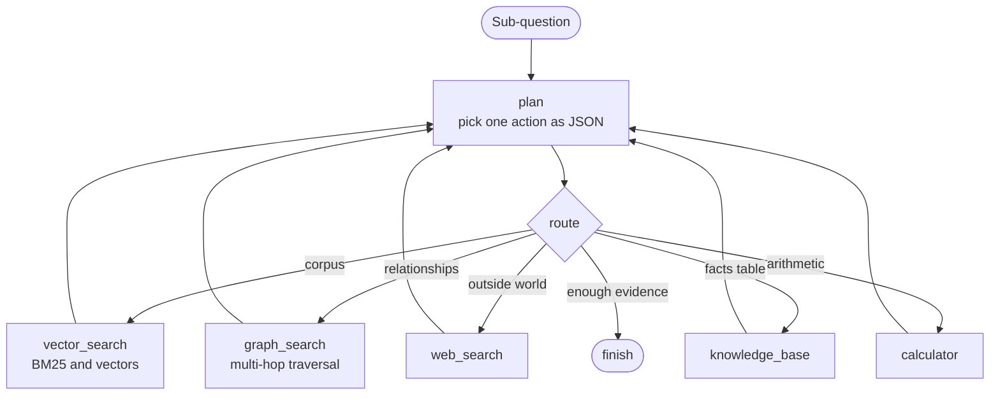

On every visit `plan` looks at what this branch has gathered so far and picks exactly one next action as a JSON decision. Tool nodes always come back to the planner, which is what lets a branch notice that the corpus answered part of the question but the outside world is needed for the rest, or see an error and route around it.

**The orchestrator** wraps several of those loops:

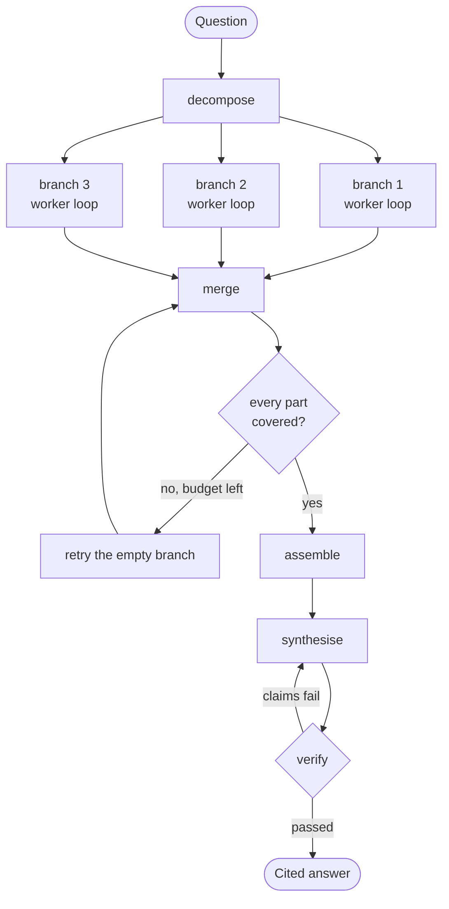

`decompose` works out how many independent sub-questions the request really contains, usually one. Each sub-question becomes a branch running its own worker loop on its own thread. `merge` is the join point. Coverage is then checked against the sub-questions that were asked: a branch that came back empty gets one more attempt while budget remains, which is the bounded retry edge.

Two things fall out that a single loop cannot give you. Independent parts of a question get researched at the same time instead of one after another, which is what you feel with a slow local model. And the verifier grades the merged result against the claims it contains, rather than the same planner that did the work marking its own homework.

The machinery only appears when a question genuinely has independent parts. A single sub-question runs inline on the calling thread and emits the same events in the same order as before the graph existed, which is why every pre-existing test still passes untouched.

## Why branches keep their own state

Each branch runs on its own `BranchState`: its own sub-question, its own evidence list, its own steps, its own error. Nothing it does can reach another branch, and only a small summary crosses back out.

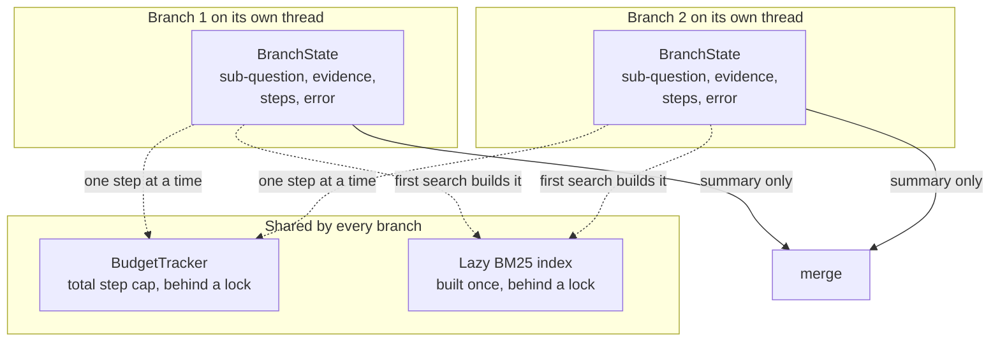

That isolation is what makes the parallelism safe. The alternative, one shared evidence list with several branches appending concurrently, invites exactly the class of bug that is hardest to see: no exception, just a result that is quietly wrong.

The step budget is the deliberate exception. One `BudgetTracker` is shared by every branch, so the cap is on total work rather than per branch. That means several threads increment the same counter, which is why it carries a lock. `self.used += 1` is not atomic, and without the lock parallel branches quietly lose steps and overrun the cap. A test hammers it with four threads and asserts the total is exactly the cap.

## What parallelism exposed

Adding real threads surfaced a race the sequential version could never hit. `HybridSearcher` builds its BM25 index lazily and caches it against the store's chunk count, a read-modify-write across two fields. With branches searching concurrently, two of them could enter that block at the same time, both rebuild the index, and leave the cached count disagreeing with the cached index.

The fix is a lock around the lazy build. Reads of the NumPy vector store stay lock-free because they are genuinely read-only. The cost is nothing that matters: index construction happens once per corpus change, while the model calls around it take seconds.

The SQLite graph store has the same treatment for a different reason: Python's implicit cursors interleave across threads on Windows regardless of the library's thread-safety level, so every graph read and write goes through one re-entrant lock.

## The decomposer's three layers

A local model's structured output fails in ways a frontier API's rarely does, so decomposition degrades in order:

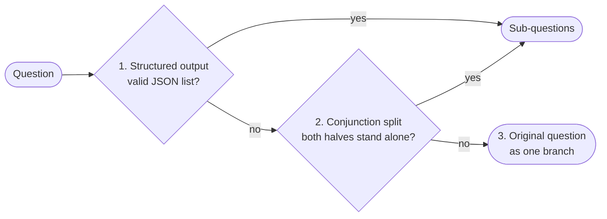

1. **Structured output.** The model returns `{"sub_questions": [...]}`, which is validated for count, length, and duplicates.
2. **A conservative heuristic.** If that is unusable, a conjunction split runs, but only when both halves stand on their own. "When was the company founded and where?" must not become a branch researching "where?", so each half needs enough length and enough content words to be a question by itself. That exact case is a test.
3. **The original question.** If neither produces something sane, the request runs as a single branch, which is always correct and never worse than the pre-graph behaviour.

The mock provider always returns the question unchanged, so offline runs, the golden-set eval, and CI stay deterministic.

## Containment

A branch that raises does not take the answer down. The exception is caught at the branch boundary, recorded on that branch's state, and reported as a `branch_error` event, while every healthy branch still contributes its evidence. An answer built from two branches out of three is worth more than a stack trace.

## Ingestion

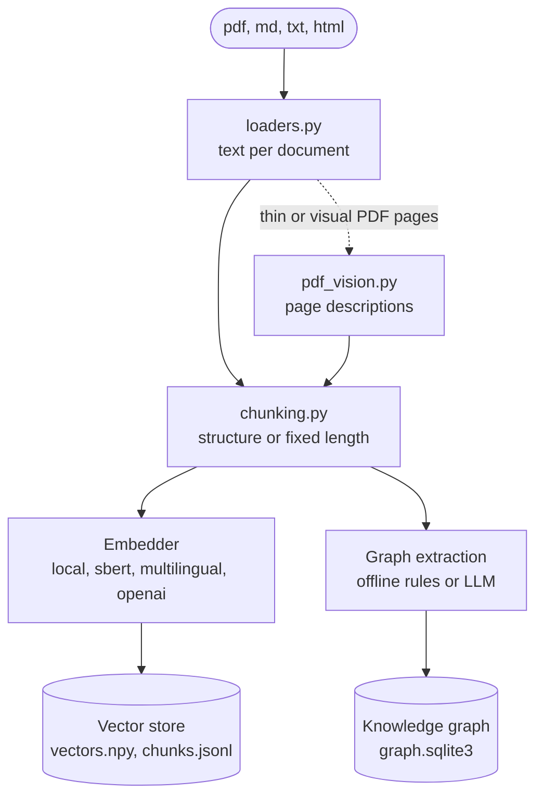

Documents are tracked by content, so re-ingesting the same file is a no-op. The store records which embedder built it and refuses to mix vectors from another one; `rag reindex` re-embeds the stored chunks when the embedder changes. Graph extraction runs after the chunks are safely indexed and can never fail an ingest: `rag graph rebuild` rebuilds the graph from stored chunks alone.

## Retrieval and context assembly

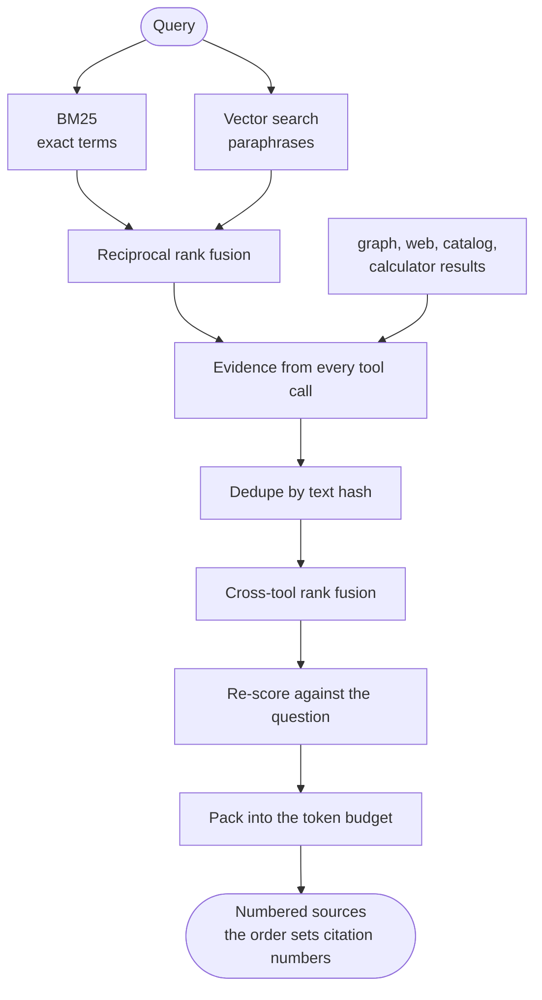

Rank fusion is the reason hybrid retrieval needs no score calibration. BM25 scores and cosine similarities live on different scales, so instead of adding them, RRF adds `1 / (k + rank)` from each list. A chunk ranked well by both wins, and a chunk only one method found still gets in. The packed order is final: the sources the model sees as `[1]`, `[2]`, `[3]` are the same numbers the console links to.

## Verification and the refine loop

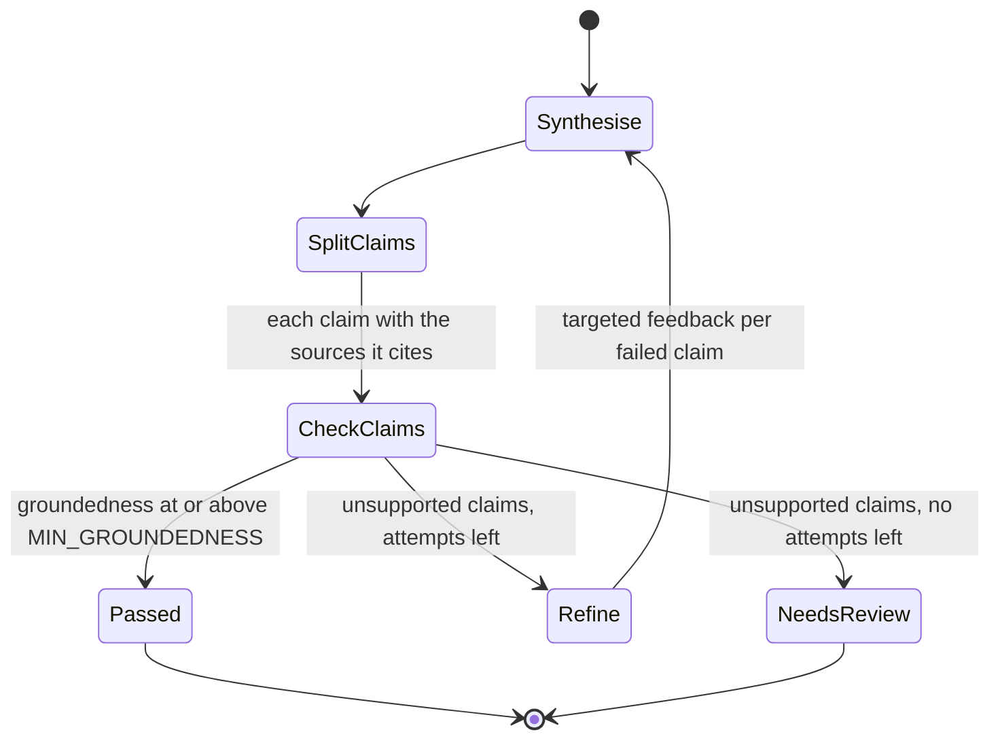

Claims are checked lexically when the mock is answering and with a dedicated model call otherwise (`VERIFIER_MODE=auto`). An explicit "the sources do not contain enough information" answer counts as a pass: abstaining honestly is the correct outcome when the evidence is missing, and a verifier that punished it would push the model towards guessing.

## Streaming

The pipeline emits events whether or not anyone is listening: `rewrite`, `decompose`, `stage`, `step`, `branch_error`, `synthesis_start`, `token`. Every step event carries the branch that produced it, so the console can tag each step with the part of the question it belongs to instead of showing one undifferentiated list. `/api/chat/stream` wraps them as server-sent events and ends with a final `answer` payload.

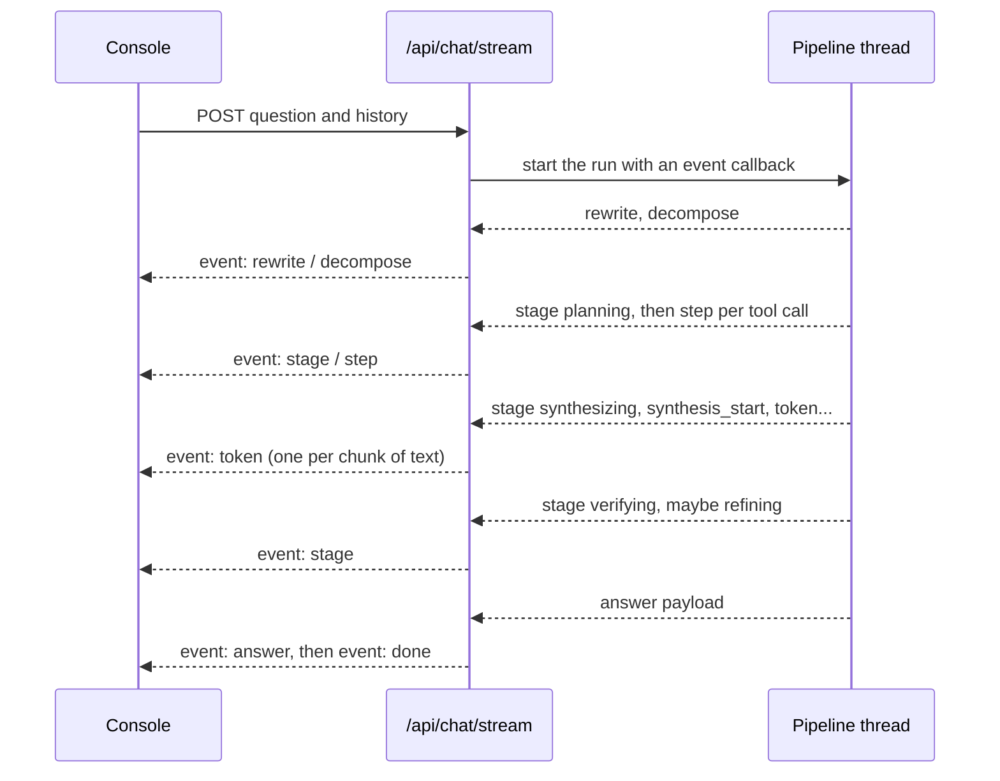

Because branches push their steps as they happen rather than being read back after they finish, parallel work reports live and interleaved. That is the visible difference in a real run: two `plan` steps arrive back to back, then two `vector_search` steps, because both branches are working at once.

If a proxy buffers or drops the stream, the console falls back to one plain `POST /api/chat` and renders the same answer without the live view.

## The provider layer

`llm/providers.py` is a small registry. Each backend is one builder function tagged `@register("name")`, selected at runtime by `LLM_PROVIDER`, and clients are constructed lazily so an unused provider's missing key cannot break anyone else. Nothing in the rest of the codebase knows which backend is underneath.

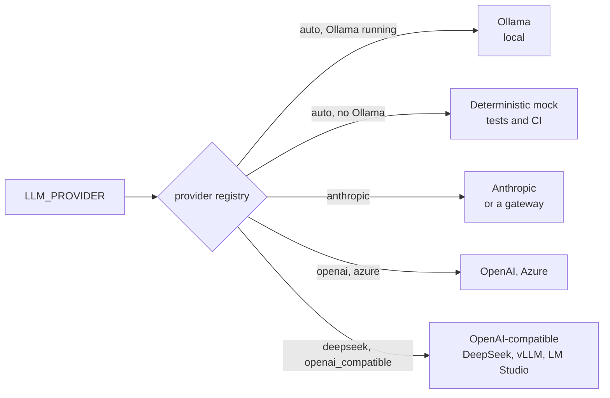

`LLM_MODEL` names the model for whichever provider is active, and it is sent through untouched, because hosted endpoints often serve names the public APIs do not. `rag models` asks the configured endpoint what it actually serves and flags whether the current setting is on the list.

Setup failures are sorted from real ones. A missing key, a rejected credential, a model the endpoint does not have, a model that refuses the `temperature` parameter: each becomes a `ProviderError` carrying the fix, and the API turns that into a readable message instead of a 500. Anything unexpected keeps its original traceback, because silently rewriting unknown errors is how debugging information gets lost.

## One model per job

A run touches the model in seven distinct roles: planning tool calls, splitting a question, rewriting a follow-up, writing the answer, verifying claims, judging an eval, and reading a page image. They do not all need the same model, and sending the mechanical ones to a cheap model is usually both cheaper and better than one model doing everything.

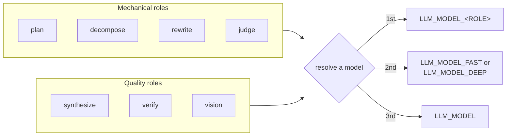

`llm/router.py` resolves a role to a model with three layers, most specific first: an `LLM_MODEL_<ROLE>` pin, then the `LLM_MODEL_FAST` and `LLM_MODEL_DEEP` tiers, then plain `LLM_MODEL`. Clients are cached per model name, so roles that land on the same model share one client and a single-model setup constructs exactly one, which is why the default behaviour is byte-identical to having no router at all.

The tiering is a default, not a rule. `FAST_ROLES` names the mechanical roles, and any role can be pinned out of it from the environment. Nothing in the pipeline names a model.

## The knowledge graph

`agentic_rag.kg` is unrelated to the orchestration graph above: it is a graph of what the documents are about. Five entity types and four relationships, small enough for an offline extractor to fill reliably:

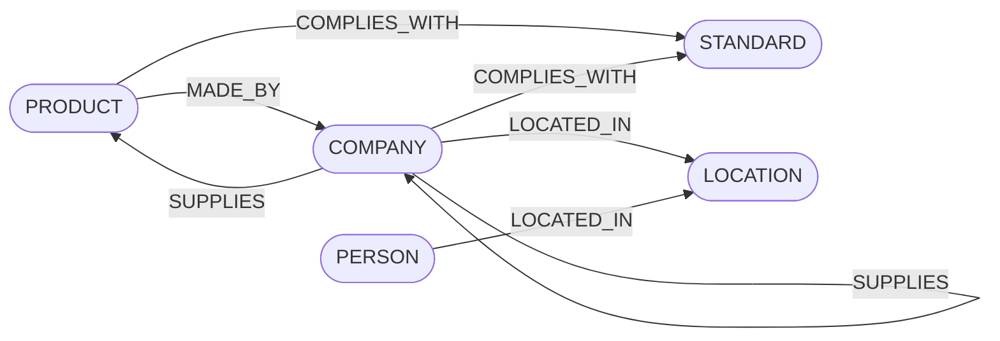

Edges are validated against those pairs, and every edge keeps the chunk it was extracted from, so `graph_search` returns the traversed path together with citable source text. The tool is only offered to the planner once the graph holds edges.

## Reading pages as images

Text extraction gets the prose and loses charts, schematics, and tables whose layout carries the meaning. `ingestion/pdf_vision.py` renders pages and asks a vision-capable model what is on them, then indexes those descriptions as ordinary chunks headed "page N (visual)". Everything downstream, retrieval, citation, verification, is unchanged, which is the point: a chart becomes a searchable passage like any other.

`auto` mode is the interesting part. Sending every page of every PDF to a model is wasteful when text extraction already worked, so `auto` measures characters per page and only spends the call when extraction came back thin. That is the scanned or figure-heavy document, which is exactly the case where the pictures are the content.

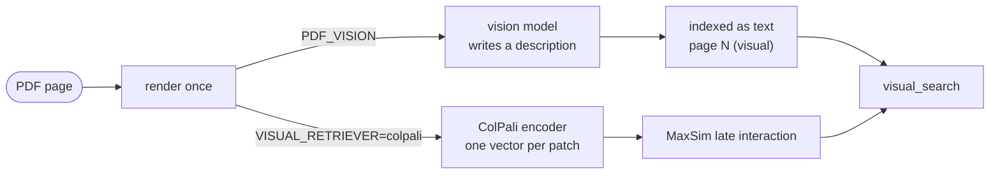

Both paths write into the same page index, and both feed the same `visual_search` tool, so the choice is one environment variable rather than a different pipeline.

## Retrieving pages as pictures

`VISUAL_RETRIEVER=colpali` switches page ranking from descriptions to the ColPali method: embed the page image itself into one vector per patch, embed the query into one vector per token, and score with MaxSim, taking each query token's best matching patch and summing. Nothing is transcribed, so a chart is matched as a chart.

The maths lives in `retrieval/late_interaction.py` and is plain NumPy, which means it is tested without torch and a different encoder can be dropped in without touching retrieval. `retrieval/colpali.py` is the encoder adapter, and it is the only file that imports torch, lazily.

Two practical notes shaped the design. Embeddings are stored one file per page rather than one matrix, because pages have different patch counts and a ragged array would need padding. And the tool is only registered once pages have actually been indexed, so the planner never sees a tool whose only possible answer is "nothing here".

The honest limitation is hardware. ColPali proper is PaliGemma-3B and ColQwen2 is Qwen2-VL-2B, both of which want a GPU and several gigabytes. colSmol is the small member of the family and is the default here because it runs on a laptop CPU. None of them fit in the 512 MB a free hosting tier gives you, which is why the description path exists and remains the default: it needs no model of its own, and it is what a free-tier deployment can actually run.

## Testing philosophy

The model is mocked in every test. What is verified is everything around it: the guardrails, the retrieval fusion, the verification maths, and above all the control flow. That tools loop back to the planner, that decomposition stays conservative, that branches genuinely run at the same time, that the shared budget holds exactly under contention, that one failing branch is contained, that streaming emits its events and exactly one final answer.

Those properties hold regardless of which model is plugged in, which is the point. Model quality changes the answers. It does not change whether the loop is safe.
