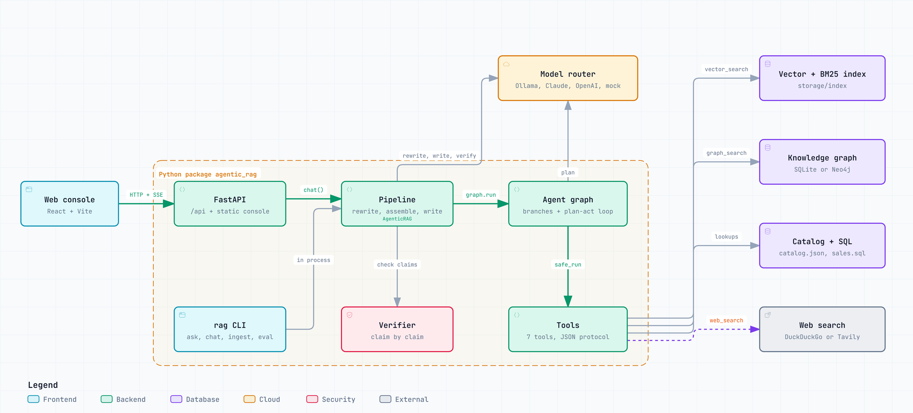
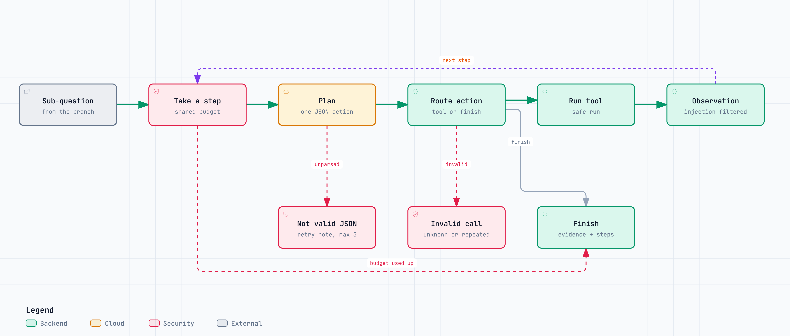
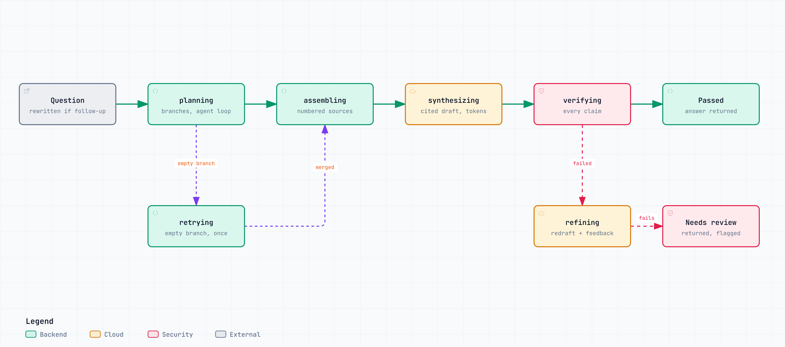
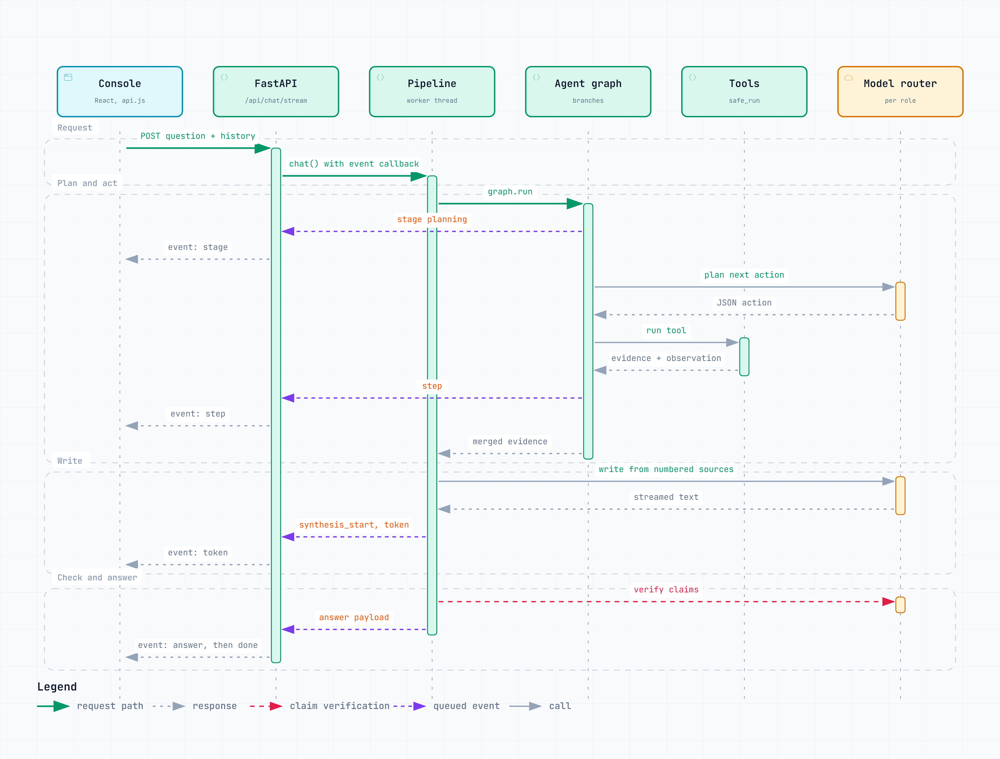
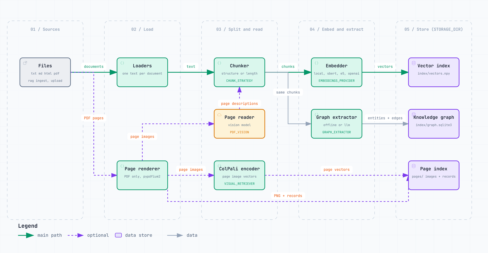
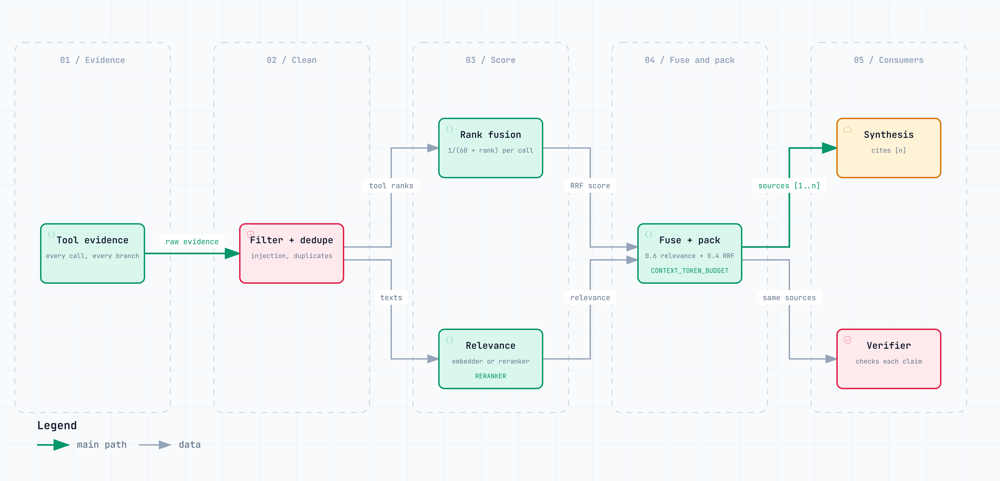
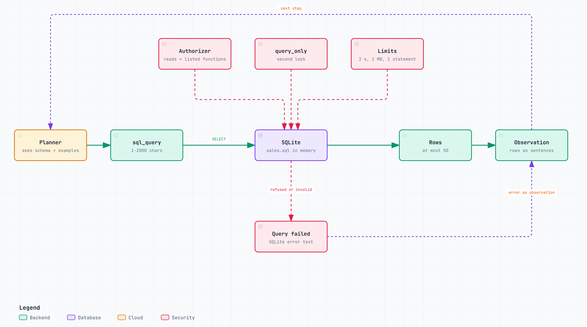

# Architecture

[](https://www.python.org)
[](https://fastapi.tiangolo.com)
[](https://numpy.org)
[](https://sqlite.org)
[](https://react.dev)
[](https://ollama.com)
[](#design-decisions)

The [README](../README.md) covers what the assistant does. This page covers how: the system on one
page, each flow from question to verified answer, and the trade-offs behind them.

**On this page:** [System](#the-system-on-one-page) · [Layers](#the-layers) ·
[Agent and orchestrator](#the-agent-and-the-orchestrator) · [Answer turn](#answer-turn-and-streaming) ·
[Ingestion](#ingestion) · [Retrieval](#retrieval-and-context-assembly) · [Text-to-SQL](#text-to-sql) ·
[Knowledge graph](#the-knowledge-graph) · [Models](#models-and-providers) ·
[Design decisions](#design-decisions) · [Testing](#testing-philosophy)

## The system on one page

<picture>
  <source media="(prefers-color-scheme: dark)" srcset="images/system-overview-dark.png">
  
</picture>

Everything flows through `src/agentic_rag/pipeline.py`, which is the best file to read first. A
question takes this path:

1. **Rewrite.** A follow-up in a conversation becomes a standalone question.
2. **Orchestrate.** The question is split into independent sub-questions when it has them, and each
   runs its own agent loop on its own thread. [The agent and the orchestrator](#the-agent-and-the-orchestrator)
3. **Act.** Each loop plans one JSON action at a time and calls a tool: corpus search, graph
   traversal, page-image search, web search, the catalog, the SQL database, or the calculator.
4. **Assemble.** Evidence from every call is filtered, deduplicated, fused, re-scored, and packed into
   numbered sources. [Retrieval and context assembly](#retrieval-and-context-assembly)
5. **Synthesise and verify.** The model writes a cited answer, every claim is checked against the
   sources it cites, and a failed check gets one targeted redraft.
   [Answer turn and streaming](#answer-turn-and-streaming)

Every step emits live events that the console renders while the agent works.

## The layers

Each layer only calls the layers below it. Interfaces never touch retrieval directly, and nothing below
`pipeline.py` knows whether a question came from the CLI, the API, or a test.

| Layer | Package | What it owns |
|---|---|---|
| Interfaces | `cli.py`, `api.py`, `frontend/` | The command line, the REST and SSE API, the web console |
| Wiring | `pipeline.py`, `config.py` | Builds every component from one `Settings` dataclass |
| Orchestration | `graph/` | Decomposition, parallel branches, shared budget, coverage retry, merge |
| Agent | `agent/` | The plan-and-act loop, the JSON protocol, prompts, a tolerant parser |
| Tools | `tools/` | `vector_search`, `graph_search`, `visual_search`, `web_search`, `knowledge_base`, `sql_query`, `calculator` |
| Knowledge graph | `kg/` | Extraction, SQLite or Neo4j store, multi-hop traversal |
| Retrieval | `retrieval/` | NumPy vector store, BM25, hybrid fusion, reranker, page-image late interaction, reindex |
| Ingestion | `ingestion/` | Loaders, two chunking strategies, PDF page images |
| Assembly | `assembly/` | Injection filtering, dedupe, cross-tool fusion, re-scoring, token-budget packing |
| Verification | `verification/` | Claim splitting, groundedness, refine feedback, the eval judge |
| Models | `llm/`, `embeddings/` | Provider registry, per-role model router, the mock, embedders |
| Core | `core/` | Shared types, language detection, the tokeniser, injection patterns |

## The agent and the orchestrator

Retrieval runs as two nested state machines rather than one loop. Both are plain Python with no agent
framework, so the control flow stays visible and testable and the trace the console shows is the
literal execution path.

Code: `src/agentic_rag/agent/` (the worker loop) and `src/agentic_rag/graph/` (the orchestrator).
This is not `agentic_rag.kg`, which is the [knowledge graph](#the-knowledge-graph).

### The worker: one agent loop per sub-question

<picture>
  <source media="(prefers-color-scheme: dark)" srcset="images/agent-loop-dark.png">
  
</picture>

`Orchestrator.collect` in `agent/orchestrator.py` runs the loop:

1. **Take a step.** Each step claims one unit of the shared budget (`budget.take()`). When the budget is
   used up, the loop finishes with the evidence it has.
2. **Plan.** The model returns exactly one action as JSON: a tool call or `finish`. The protocol lives
   in `agent/prompts.py`, and `agent/parser.py` extracts the first JSON object even from a chatty
   reply.
3. **Guards.** A reply with no usable JSON gets a retry note, and three failures in a row end the loop.
   An unknown tool or a repeated identical call gets a corrective note instead of running.
4. **Run the tool.** `safe_run` turns any exception into an observation, so a failing tool never
   crashes the loop.
5. **Observe.** The observation passes through the [injection filter](../SECURITY.md) before the
   planner reads it, because the planner picks the next search from it.

Each branch runs at most `MAX_AGENT_STEPS` (6) steps. Tool results always come back to the planner,
which is what lets a branch notice that the corpus answered part of the question but the web is
needed for the rest, or see an error and route around it.

#### The tools

| Tool | Module | Used for |
|---|---|---|
| `vector_search` | `tools/vector_search.py` | The document corpus, hybrid BM25 and vectors |
| `graph_search` | `tools/graph_search.py` | Questions that chain facts through relationships. Offered only once the graph holds edges |
| `visual_search` | `tools/visual_search.py` | PDF pages ranked as images. Offered only once pages are indexed |
| `web_search` | `tools/web_search.py` | The outside world, through `SEARCH_PROVIDER` |
| `knowledge_base` | `tools/structured.py` | The structured catalog (`data/structured/catalog.json`) |
| `sql_query` | `tools/sql.py` | Counts, totals, and rankings over records, see [Text-to-SQL](#text-to-sql) |
| `calculator` | `tools/structured.py` | Arithmetic |

Adding a tool means one `Tool` subclass with a `ToolSpec` (`tools/base.py`), registered in
`build_default_tools` in `tools/__init__.py`.

### The orchestrator: decompose, branch, check coverage, merge

<picture>
  <source media="(prefers-color-scheme: dark)" srcset="images/orchestration-dark.png">
  
</picture>

`GraphRunner.run` in `graph/runner.py`:

1. **Decompose.** `graph/decompose.py` works out how many independent sub-questions the request
   contains, usually one.
2. **Branch.** Each sub-question runs its own worker loop. With more than one, they run on a thread
   pool of up to `MAX_BRANCHES` (3) workers.
3. **Coverage.** A branch that found nothing, and did not fail, gets one more try while the shared
   budget lasts. The retry keeps the branch index, so its steps are reported under the same part of
   the question. The console sees a `retrying` stage.
4. **Merge.** Evidence and steps are joined in branch order. On a split question each branch's
   evidence ids and call ids are made unique (`b1-e1`, `b2-e1`), because assembly keys rank fusion by
   id and groups by call. Deduplication and ranking happen later, in
   [context assembly](#retrieval-and-context-assembly).

A single sub-question runs inline on the calling thread and emits the same events in the same order
as the plain loop: `stage planning` first and no `decompose` event. Tests depend on that.

#### The decomposer degrades in three layers

1. **Structured output.** The model returns `{"sub_questions": [...]}`, which is deduplicated and
   length-checked (8 to 300 characters each).
2. **A conservative split.** If that reply is unusable, the question is split on " and ", but only
   when both halves stand alone: each needs at least 20 characters and three content words. "When
   was the company founded and where?" stays one question.
3. **The original question.** If neither produces something usable, the request runs as one branch.

The mock provider never decomposes, which keeps offline runs, the golden-set eval, and CI
deterministic. `MAX_BRANCHES=1` turns splitting off.

#### Why branches keep their own state

Each branch owns a `BranchState` (`graph/state.py`): its sub-question, its evidence, its steps, its
error. Nothing a branch does can reach another branch, which is what makes running them on threads
safe. One shared evidence list written by every branch would have them overwriting each other with
no exception, just a quietly wrong result.

Shared state is the deliberate exception, and each piece has a lock:

- **The step budget.** One `BudgetTracker` caps total tool calls across all branches at
  `MAX_TOTAL_AGENT_STEPS` (12). `self.used += 1` is not atomic, so `take()` holds a lock; a test
  hammers it from four threads and asserts the total is exactly the cap.
- **The lazy BM25 index.** `retrieval/hybrid.py` builds it on first search and caches it against the
  chunk count. Two branches searching at once could both rebuild it, so the build is locked. Reads of
  the NumPy vector store stay lock-free.
- **The SQLite graph store and the SQL connection.** SQLite connections are not safe to share across
  threads, so every graph read and write and every `sql_query` call goes through a lock.

#### Containment

A branch that raises does not take the answer down. The exception is caught at the branch boundary,
stored on that branch, and reported as a `branch_error` event, while every healthy branch still
contributes its evidence.

## Answer turn and streaming

What happens to one question from the moment it arrives until the answer is returned, and the live
events the console receives along the way.

Code: `AgenticRAG.chat` in `src/agentic_rag/pipeline.py`, `/api/chat/stream` in `src/agentic_rag/api.py`.

### The stages of one turn

<picture>
  <source media="(prefers-color-scheme: dark)" srcset="images/answer-turn-dark.png">
  
</picture>

1. **Rewrite.** In a conversation, a follow-up such as "and what does it cost?" is rewritten into a
   standalone question from the recent turns. This needs a real model: with the mock, or with no
   history, the question is used as it is. A changed question is reported as a `rewrite` event.
2. **planning.** The [orchestrator](#the-agent-and-the-orchestrator) decomposes the question and runs the agent loop per
   branch. Empty branches can add a `retrying` stage.
3. **assembling.** [Context assembly](#retrieval-and-context-assembly) turns all evidence into numbered sources.
4. **synthesizing.** The model writes the answer from the numbered sources only, citing them as `[1]`
   or `[2][3]`. When a cited page image is in the context and the model can see, the image itself is
   attached (up to `VISION_CONTEXT_PAGES`, 2).
5. **verifying.** The answer is split into claims and each is checked against the sources it cites.
6. **refining.** If the check fails, the answer is rewritten with the failing claims as feedback and
   checked again, up to `MAX_REFINE_ATTEMPTS` (1) times.

#### The pass rule

`verification/verifier.py` passes an answer when **groundedness is at least `MIN_GROUNDEDNESS` (0.7)
and citation coverage is at least 0.5**. Groundedness is the share of claims the cited sources
support; citation coverage is the share of claims that cite anything.

The fixed answer "The available sources do not contain enough information to answer this question."
always passes: abstaining is the correct outcome when the evidence is missing, and a verifier that
punished it would push the model towards guessing.

Every answer is returned. One that still fails after refining is shown in the console as
**Needs review** rather than hidden.

Claims are checked lexically when the mock is answering and with a dedicated model call otherwise
(`VERIFIER_MODE=auto`). Set `lexical` or `llm` to force one.

### The event stream

<picture>
  <source media="(prefers-color-scheme: dark)" srcset="images/chat-stream-dark.png">
  
</picture>

`POST /api/chat/stream` starts the pipeline on a worker thread with an event callback that puts every
event on a queue, and streams the queue as server-sent events (`event: <name>` then `data: <json>`).

| Event | Payload | When |
|---|---|---|
| `rewrite` | `{"question"}` | A follow-up was rewritten |
| `decompose` | `{"sub_questions"}` | The question was split into more than one part |
| `stage` | `{"name"}` | `planning`, `retrying`, `assembling`, `synthesizing`, `verifying`, `refining` |
| `step` | one agent step, with its `branch` | After every tool call or finish |
| `branch_error` | `{"branch", "message"}` | One branch raised; the others continue |
| `synthesis_start` | `{"attempt"}` | Before the first token of each draft, so a redraft can replace the text |
| `token` | `{"text"}` | Each piece of the streamed answer |
| `answer` | the full answer payload | Once, at the end |
| `error` | `{"message"}` | The pipeline failed, or no event arrived for 300 seconds |
| `done` | `{}` | The stream is over |

Because branches push their steps as they happen, parallel work reports live and interleaved: two
`plan` steps arrive back to back, then two `vector_search` steps, because both branches are working at
once.

If a proxy buffers or drops the stream, the console falls back to one plain `POST /api/chat` and
renders the same answer without the live view (`frontend/src/App.jsx`).

These event names and the framing are consumed by the console, so a change has to be made on both
sides together.

## Ingestion

How files become chunks, vectors, graph edges, and page images under `STORAGE_DIR`.

Code: `AgenticRAG.ingest` in `src/agentic_rag/pipeline.py`, plus `src/agentic_rag/ingestion/`.

### The data path

<picture>
  <source media="(prefers-color-scheme: dark)" srcset="images/ingest-dark.png">
  
</picture>

For every file under the given path (subfolders included):

1. **Load.** `ingestion/loaders.py` reads `.txt`, `.md`, `.markdown`, `.html`, `.htm`, and `.pdf` into
   one text per document. A file that cannot be read is reported and skipped; the rest of the batch
   continues.
2. **Skip known files.** A document's id is a hash of its resolved file path, so ingesting the same
   path again is a no-op. A changed file at the same path is not re-read; a copy at a new path is a
   new document.
3. **Chunk.** `CHUNK_STRATEGY=structure` (default) keeps headings and sentences intact;
   `length` is a fixed window. Targets come from `CHUNK_TARGET_CHARS` (900) and
   `CHUNK_OVERLAP_CHARS` (150).
4. **Page images (PDF only).** See [below](#pdfs-that-carry-their-meaning-in-pictures).
5. **Embed and store.** `EMBEDDINGS_PROVIDER` (`local`, `sbert`, `multilingual`, `openai`) embeds the
   chunks into the NumPy vector store.
6. **Extract the graph.** With `GRAPH_EXTRACTION` on (the default), the same chunks feed the
   [knowledge graph](#the-knowledge-graph). A failure here never fails the ingest: a failing chunk is
   skipped and counted, a failing document is reported, and the document stays in the index.
   `rag graph rebuild` is the recovery path.

#### What lands where

| Path under `STORAGE_DIR` (default `storage/`) | Written by |
|---|---|
| `index/vectors.npy`, `index/chunks.jsonl`, `index/manifest.json` | The vector store |
| `index/graph.sqlite3` | The SQLite graph store (`GRAPH_STORE=sqlite`) |
| `pages/` and `pages/images/` | Page records and rendered PNGs, when page images are on |
| `uploads/` | Files uploaded through the console or `/api/upload` |

The manifest records which embedder built the index, and the store refuses to mix vectors from
another one. After changing `EMBEDDINGS_PROVIDER`, run `rag reindex`, which re-embeds the stored
chunks without needing the source files and keeps chunk ids stable.

### Uploading through the console

<picture>
  <source media="(prefers-color-scheme: dark)" srcset="images/upload-ingest-dark.png">
  
</picture>

`POST /api/upload` takes multipart files. Each one is checked before anything is written:

- the extension must be a supported type,
- the file name is reduced to a bare, safe name and must resolve inside `storage/uploads/`,
- the size must stay under `UPLOAD_MAX_MB` (25); an oversized file is deleted as soon as it crosses
  the limit.

An existing name gets a `-1`, `-2` suffix rather than being overwritten. Every saved file is then
ingested as above, and the response lists each file as `saved` or `rejected` with the reason. See the
[API reference](api.md#post-apiupload).

`POST /api/ingest` instead reads a path on the server, limited to the folders in `INGEST_ROOTS`
(default `data`) and the uploads folder. The `rag ingest` CLI has no such limit.

### PDFs that carry their meaning in pictures

Text extraction gets the prose and loses charts, schematics, and tables whose layout carries the
meaning. `data/sample_pdfs/auralis-quarterly-review.pdf` shows it: its quarterly figures exist only
as bar heights, and a test asserts that text extraction does not find them.

Pages are rendered once (`pip install -e ".[vision]"` adds the renderer) and can be used two ways.

**Descriptions (`PDF_VISION`, default `auto`).** A vision-capable model describes each page, and the
description is indexed as an ordinary chunk headed "page N (visual)". `off` never does this, `on`
always does, and `auto` is meant to do it only when text extraction came back thin (under 220
characters per page, counted from the PDF's real pages). It only runs when the active model can read
images. Up to `VISION_MAX_PAGES` (20) pages are rendered at `VISION_SCALE` (2.0).

**ColPali (`VISUAL_RETRIEVER=colpali`).** Page images are embedded directly, one vector per patch, and
ranked by late interaction (MaxSim). This needs `pip install -e ".[colpali]"` (colpali-engine and
torch). `COLPALI_MODEL` blank uses colSmol, the CPU-friendly model. The maths is plain NumPy in
`retrieval/late_interaction.py`, and `retrieval/colpali.py` is the only file that imports torch.

Both paths write into the same page index, and the `visual_search` tool is registered only once pages
are indexed. When a retrieved page reaches synthesis and the answering model can see, the page image
itself is attached to the prompt.

| | `PDF_VISION` descriptions | `VISUAL_RETRIEVER=colpali` |
|---|---|---|
| Extra install | page renderer, small | colpali-engine and torch, large |
| Hardware | none | CPU works with colSmol |
| Cost | one model call per page at ingest | one forward pass per page, then per query |
| Fits a 512 MB free hosting tier | yes | no |

### Commands

```bash
rag ingest data/sample_docs     # index a folder
rag reindex                     # re-embed stored chunks after changing the embedder
rag graph rebuild               # rebuild the knowledge graph from stored chunks
rag stats                       # what the pipeline resolved and how much is indexed
```

## Retrieval and context assembly

How the corpus is searched, and how evidence from every tool call becomes the numbered sources the
model cites.

Code: `src/agentic_rag/retrieval/` and `src/agentic_rag/assembly/context_assembly.py`.

### Hybrid search

`vector_search` runs `HybridSearcher` (`retrieval/hybrid.py`). With `RETRIEVAL_MODE=hybrid` (default)
it fetches BM25 keyword hits and vector hits (at least 8 of each) and fuses the two rankings with
reciprocal rank fusion. `vector` and `bm25` use one method alone.

Rank fusion is why hybrid retrieval needs no score calibration. BM25 scores and cosine similarities
live on different scales, so instead of adding them, RRF adds `1 / (60 + rank)` from each list. A chunk
ranked well by both wins, and a chunk only one method found still gets in. BM25 catches exact terms
such as "ISO 3691-4" that an embedder can rank below a paraphrase; vectors catch the paraphrase.

The BM25 index is built lazily on the first search and rebuilt when the chunk count changes. That
build is behind a lock, because parallel branches can search at the same moment.

### Context assembly

<picture>
  <source media="(prefers-color-scheme: dark)" srcset="images/context-assembly-dark.png">
  
</picture>

`assemble()` runs over the merged evidence of every branch and every tool:

1. **Filter.** `core/injection.py` replaces sentences that try to instruct the model with a visible
   `[removed: ...]` marker. Text with no match comes back unchanged, character for character, which
   keeps English retrieval and the eval byte-identical.
2. **Deduplicate.** Evidence with the same normalised text is merged, keeping the best raw score.
3. **Rank fusion across tool calls.** Within each tool call, evidence is sorted by its rank and
   scores `1 / (60 + position)`.
4. **Relevance.** Each candidate is scored against the question. By default the embedder embeds
   question and passage separately and compares them. `RERANKER=cross-encoder` (needs
   `pip install -e ".[rerank]"`) reads the pair together instead; if it raises, assembly falls back to
   the embedder with a note on stderr, so a reranker problem costs precision, never an answer.
5. **Fuse.** `0.6 * relevance + 0.4 * normalised RRF`. The reranker replaces only the relevance term,
   so a strong hit from one tool still counts.
6. **Pack.** Highest fused score first, greedily, into `CONTEXT_TOKEN_BUDGET` (2200 tokens). The top
   item always fits, an item that would overflow is skipped so a smaller one may still fit, and at most
   12 sources are kept.

The packed order is final: the sources the model sees as `[1]`, `[2]`, `[3]` are the numbers the
console links to and the [verifier](#the-pass-rule) checks against.

`RERANKER_MODEL` defaults to `cross-encoder/ms-marco-MiniLM-L-6-v2` (English). For other languages,
`cross-encoder/mmarco-mMiniLMv2-L12-H384-v1` is an option. The bundled golden set already scores 11/11
without a reranker, so measure on your own corpus before relying on one.

### Languages

Retrieval works beyond English, and English behaves exactly as it did before.

- Tokenisation (`core/textutils.py`) keeps letters from any script, so umlauts survive and Arabic and
  Urdu produce real tokens. English output is byte-identical to the earlier ASCII-only rule;
  `tests/test_multilingual.py` keeps a copy of the old rule to check against.
- Chinese and Japanese runs are indexed as overlapping bigrams, on both the index and the query side.
- `core/lang.py` detects the language from the script first, then from stopword hits, and leans
  towards English on weak evidence. English, German, Arabic, Chinese, and Urdu ship with stopword
  lists.
- Answers come back in the language of the question; `ANSWER_LANGUAGE` pins one instead.

For a genuinely multilingual corpus, the hashed `local` embedder only matches shared tokens. Switch to
the multilingual model and rebuild:

```bash
pip install -e ".[multilingual]"
# in .env: EMBEDDINGS_PROVIDER=multilingual
rag reindex
```

## Text-to-SQL

Some questions are about records, not passages: which customer ordered the most robots, how many
orders are still open. Retrieval ranks text and cannot count or add up rows, so `sql_query` lets the
planner ask a database directly.

Code: `src/agentic_rag/tools/sql.py`. Sample data: [`data/structured/sales.sql`](../data/structured/sales.sql)
(fictional customers and orders).

<picture>
  <source media="(prefers-color-scheme: dark)" srcset="images/text-to-sql-dark.png">
  
</picture>

### How it works

- **The planner writes the SQL.** The schema and the worked examples are part of the tool description,
  so they sit next to the question in the planning prompt. There is no separate text-to-SQL model call.
- **Errors come back as advice.** A failing query returns SQLite's own message as the observation, and
  the planner fixes the query on its next step.
- **Every number can be rerun.** The evidence's source reference is the query itself.
- **Your own data.** `SQL_DATABASE_PATH` takes a `.sql` script, which is loaded into an in-memory
  database so nothing is written to disk, or a `.db`, `.sqlite`, or `.sqlite3` file, which is opened
  read-only in place (`mode=ro`). In a `.sql` script, `-- Q:` and `-- SQL:` comment pairs become the
  worked examples. A blank value turns the tool off.

```text
$ rag ask "Which customer has ordered the most robots in total?" --trace

-- ANSWER --------------------------------------------------------------
Database query result: name Nordlicht Logistik, robots ordered 32. [1]
```

That is the offline mock, which quotes the row as it came back. A real model writes a sentence
around it.

### Read-only is enforced by SQLite

Safety never depends on reading the SQL text, because text filters are easy to talk around:

| Attempt | What stops it |
|---|---|
| `DELETE`, `UPDATE`, `INSERT`, `CREATE`, `DROP` | An authorizer that allows `SELECT` and `READ` and nothing else |
| `ATTACH DATABASE`, `PRAGMA` | The same authorizer, plus a `query_only` connection |
| `SELECT 1; DROP TABLE orders` | `execute()` runs exactly one statement |
| `randomblob(900000000)`, `printf`, `load_extension` | Functions must be on an allowlist of aggregate, math, text, and date functions |
| One enormous string, such as `group_concat` over a huge join | A 1 MB cap per value (`SQLITE_LIMIT_LENGTH`, Python 3.11 and later) |
| A query that never ends | A progress handler that interrupts it after 2 seconds |
| A result with a million rows | At most 50 rows come back |
| A query longer than 2000 characters | Rejected before it runs |

One connection serves every branch, and SQLite connections are not safe to share across threads, so
queries go through a lock.

### Offline behaviour

The mock cannot write SQL. It runs the worked example a question closely matches: at least two shared
content words, covering at least 60% of the example's words. That keeps the three database questions
in the golden set deterministic.

### Limits

SQLite only, one statement per call. Recursive CTEs and functions outside the allowlist are refused
along with writes. On Python 3.10 the 1 MB value cap is not available; the allowlist and the time limit
still apply.

## The knowledge graph

A graph of what the documents are about, so a question whose answer is not written in any single
passage can be answered by following relationships instead of ranking similarity.

Code: `src/agentic_rag/kg/` and `src/agentic_rag/tools/graph_search.py`. The pipeline attribute is
`knowledge_graph`. This is unrelated to `agentic_rag.graph`, the [orchestrator](#the-agent-and-the-orchestrator).

<picture>
  <source media="(prefers-color-scheme: dark)" srcset="images/knowledge-graph-dark.png">
  
</picture>

### Why it exists

The corpus says the Atlas P2 is made by Auralis Dynamics, that Auralis Dynamics is in Munich, and that
the Atlas platform is certified to ISO 3691-4:2023. Three documents, three facts, no passage holding
more than one of them. Ask which standard applies to the robot from the Munich company and similarity
search has nothing to rank.

```text
$ rag graph explain "Which safety standard applies to the robot made by the company headquartered in Munich?" --hops 3

SEEDS
  Munich (LOCATION)

PATH (3 hop max)
  hop 1: Auralis Dynamics -[LOCATED_IN]-> Munich
  hop 2: Atlas P2 -[MADE_BY]-> Auralis Dynamics
  hop 3: Atlas P2 -[COMPLIES_WITH]-> ISO 3691-4:2023
```

`tests/test_knowledge_graph.py::test_traversal_retrieves_answers_similarity_search_misses` compares
what each path retrieves. A single fact in one passage stays on `vector_search`.

### Schema

Five entity types and four edge types (`kg/schema.py`), small enough for an offline extractor to fill
reliably.

| Entity type | Example |
|---|---|
| `COMPANY` | Auralis Dynamics, SAP |
| `PRODUCT` | Atlas P2, Atlas Hive |
| `PERSON` | Bernd Montag |
| `STANDARD` | ISO 3691-4:2023, GDPR, SOC 2 Type II |
| `LOCATION` | Munich, Walldorf |

| Edge | From | To |
|---|---|---|
| `MADE_BY` | PRODUCT | COMPANY |
| `SUPPLIES` | COMPANY | COMPANY, PRODUCT |
| `COMPLIES_WITH` | PRODUCT, COMPANY | STANDARD |
| `LOCATED_IN` | COMPANY, PERSON | LOCATION |

Edges are checked against those pairs (`EDGE_DOMAINS`), so a cue word cannot produce a location that
complies with a standard. Every edge keeps the chunk and sentence it came from.

### Extraction

`GRAPH_EXTRACTOR` picks the extractor (`kg/extractors.py`):

- `offline` is patterns and rules, with no key, network, or cost. Standards come from their number
  format, companies from corporate suffixes, products from model codes, people from titles, locations
  from prepositions. Every edge needs a cue word between the two mentions.
- `llm` asks the configured model for JSON per chunk. It reads far more than patterns can and costs one
  model call per chunk. An unparseable reply falls back to the offline rules for that chunk.
- `auto` (default) uses `llm` only when `LLM_PROVIDER` is set to something other than `auto` or
  `mock`, so a plain `rag ingest` never starts spending model calls because Ollama happened to be
  running.

Entities per chunk are capped by `GRAPH_MAX_ENTITIES_PER_CHUNK` (12). `GRAPH_EXTRACTION=false` turns
extraction off.

#### Entity resolution, and what it does not do

Names are normalised (case, whitespace, Unicode NFKC) and looked up in an exact-match alias table,
`data/graph_aliases.json` (`GRAPH_ALIAS_PATH`), in the format
`{"surface form": ["Canonical Name", "TYPE"]}`. That is all of it:

- no fuzzy or embedding matching: "Auralis Dynamic" and "Auralis Dynamics" stay two nodes unless an
  alias joins them,
- no coreference: "the company" in a later sentence links to nothing,
- no disambiguation: two companies with one name become one node,
- the offline extractor leans on capitalisation, so non-Latin chunks mostly yield standards and alias
  hits.

### graph_search

The tool links the question to seed entities, walks breadth-first out to `GRAPH_HOPS` (2) hops (the
planner can ask for up to 4) and at most 40 entities, and returns the traversed path plus the chunks
the walked edges came from, so answers stay cited to source text. It is offered to the planner only
once the graph holds edges.

### Storage and operations

SQLite by default, in `storage/index/graph.sqlite3` next to the vector index. Writes are idempotent per
document. Every read and write goes through one re-entrant lock, because parallel branches share the
connection.

`GRAPH_STORE=neo4j` with `pip install -e ".[neo4j]"` selects the optional Neo4j backend
(`NEO4J_URI`, `NEO4J_USER`, `NEO4J_PASSWORD`, `NEO4J_DATABASE`). No test or default run touches it.

```bash
rag graph stats                  # entity and relationship counts by type
rag graph rebuild                # rebuild from stored chunks, no source files needed
rag graph explain "<question>"   # the seeds and every hop walked
rag eval --golden eval/golden_set_graph.jsonl
```

Graph building never breaks ingest: a chunk the extractor fails on is skipped and counted, a failing
document is reported, and the documents still land in the index. After
`GRAPH_MAX_CONSECUTIVE_FAILURES` (5) failures in a row, extraction for that document stops.

## Models and providers

One variable switches the backend, and the pipeline is identical across all of them.

Code: `src/agentic_rag/llm/` (`providers.py`, `router.py`, `ollama.py`, `mock.py`).

<picture>
  <source media="(prefers-color-scheme: dark)" srcset="images/models-dark.png">
  
</picture>

### Providers

`llm/providers.py` is a small registry: each backend is one builder function tagged
`@register("name")`, chosen by `LLM_PROVIDER`. Clients are built lazily, so a missing key for an unused
provider cannot break anything.

| `LLM_PROVIDER` | Needs | Model setting |
|---|---|---|
| `auto` (default) | nothing | Ollama when it answers at `OLLAMA_BASE_URL`, otherwise the mock |
| `ollama` | a running Ollama | `OLLAMA_MODEL`, blank picks one (see below) |
| `anthropic` | `ANTHROPIC_API_KEY` | `ANTHROPIC_MODEL`, default `claude-sonnet-4-6` |
| `openai` | `OPENAI_API_KEY` (required for api.openai.com) | `OPENAI_MODEL`, default `gpt-4o-mini` |
| `azure` | `AZURE_OPENAI_ENDPOINT`, `AZURE_OPENAI_DEPLOYMENT`, `AZURE_OPENAI_API_KEY` | the deployment |
| `deepseek` | `DEEPSEEK_API_KEY` | `DEEPSEEK_MODEL`, default `deepseek-flash` |
| `openai_compatible` | `OPENAI_BASE_URL` (vLLM, LM Studio, gateways), `OPENAI_API_KEY` only if the endpoint wants one | `OPENAI_MODEL` |
| `mock` | nothing | deterministic offline answers for tests and CI |

`LLM_MODEL`, when set, wins over the provider-specific model setting, so one variable covers every
backend. The name is sent through untouched, because private endpoints often serve names the public
APIs do not; `rag models` asks the endpoint what it serves and flags whether your setting is on the
list. `ANTHROPIC_BASE_URL` and `OPENAI_BASE_URL` point a provider at a private or self-hosted endpoint,
and `LLM_EXTRA_HEADERS` (JSON) adds headers a gateway needs.

```bash
# .env, Claude
LLM_PROVIDER=anthropic
ANTHROPIC_API_KEY=<YOUR_API_KEY>
LLM_MODEL=claude-sonnet-4-6
```

**Ollama auto-pick.** With `OLLAMA_MODEL` blank, the client takes the first installed model that
matches a fixed preference list ordered by how reliably models follow the JSON planning protocol
(`qwen2.5:14b`, `qwen2.5:7b-instruct`, then other qwen, llama, mistral, phi, and gemma tags), and
otherwise the first installed model. `ollama pull qwen2.5:7b-instruct` is the recommended start.

**Setup failures are readable.** A missing key, a rejected credential, a model the endpoint does not
have, or a model that refuses `temperature` becomes a `ProviderError` that names the fix, and the API
returns that message instead of a 500. `LLM_TEMPERATURE=` (blank) leaves the field out for models that
reject it. Verifying, judging, splitting, and rewriting always run at `0.0`.

### One model per job

A run uses the model in seven roles: `plan`, `decompose`, `rewrite`, `synthesize`, `verify`,
`judge`, and `vision`. `llm/router.py` resolves each role, most specific first:

1. `LLM_MODEL_<ROLE>`, for example `LLM_MODEL_JUDGE`,
2. `LLM_MODEL_FAST` for the fast roles (`plan`, `decompose`, `rewrite`, `judge`) or `LLM_MODEL_DEEP`
   for the rest,
3. `LLM_MODEL`.

```bash
LLM_MODEL_FAST=deepseek-flash      # plan, decompose, rewrite, judge
LLM_MODEL_DEEP=deepseek-v4-pro     # synthesize, verify, vision
```

Clients are cached per model name, so roles on the same model share one client and a single-model
setup builds exactly one. `rag stats` and `/api/health` show the resolved map when more than one model
is in play.

### The mock

`llm/mock.py` speaks the same JSON protocol as a real model, deterministically. It is what keeps
`pytest`, `rag eval`, and CI working with no network and no keys, and `LLM_PROVIDER=auto` always falls
back to it when Ollama is absent. It never decomposes a question, and it answers by quoting the
retrieved sentence that best overlaps the question.

Its contract is load-bearing: the MODE markers in system prompts, the `OBSERVATION {i} ({tool}):`
format in the orchestrator, and the `END OF SOURCES` terminator in synthesis prompts must change
together with `mock.py`.

### Checking a real model

```bash
rag stats                              # which LLM and embedder resolved
rag models                             # what the configured endpoint serves
python scripts/smoke_language.py       # a German question end to end, reports the answer language
```

`smoke_language.py` exit codes: 0 answered in German, 1 another language, 2 the provider is not
configured, 3 the index is empty.

## Design decisions

**No agent framework.** The orchestration, fusion, streaming, and verifier are plain Python. For a
system whose point is showing how agentic RAG works, a framework would hide the parts worth reading.
The console follows the same rule: React and one stylesheet, no UI library.

**Local-first, cloud-optional.** Ollama is the default because it costs nothing and keeps data on your
machine. The same interface covers Claude, OpenAI, Azure, DeepSeek, and compatible gateways, so
switching is one variable.

**A strict JSON protocol, and a mock that speaks it.** The loop runs on a small JSON contract instead
of provider-specific function calling. That is what makes a deterministic offline mock possible, and
why the tests, the eval, the streaming events, and CI run with no network and no keys.

**Isolated branch state.** Each branch owns its evidence, steps, and errors. The step budget, the lazy
BM25 build, and the SQLite connections are the shared exceptions, and each has a lock.

**Enforce limits in the engine, not in a filter.** The SQL tool does not scan queries for dangerous
keywords; SQLite's authorizer refuses anything but a read. The injection filter is the one place text
matching is used, and it sits behind prompts that already treat sources as data.

**Verification is the feature.** The answer is split into claims, each is checked against what it
cites, failed claims trigger a redraft with targeted feedback, and an unanswerable question gets an
explicit abstention.

**Honest limitations.** Offline, the verifier and judge are lexical approximations. The hashed
embedder is a demo device; use `sbert` or `multilingual` for real semantic quality. The vector store
is exact NumPy search, fine up to tens of thousands of chunks and intentionally not a vector database.
Follow-up rewriting and decomposition need a real model, and very small models sometimes struggle with
the JSON tool loop.

## Testing philosophy

The model is mocked in every test. What is verified is everything around it: the guardrails, the
retrieval fusion, the verification maths, and the control flow. That tools loop back to the planner,
that decomposition stays conservative, that branches really run at the same time, that the shared
budget holds exactly under contention, that one failing branch is contained, and that streaming emits
its events and exactly one final answer. Model quality changes the answers; it does not change whether
the loop is safe.
