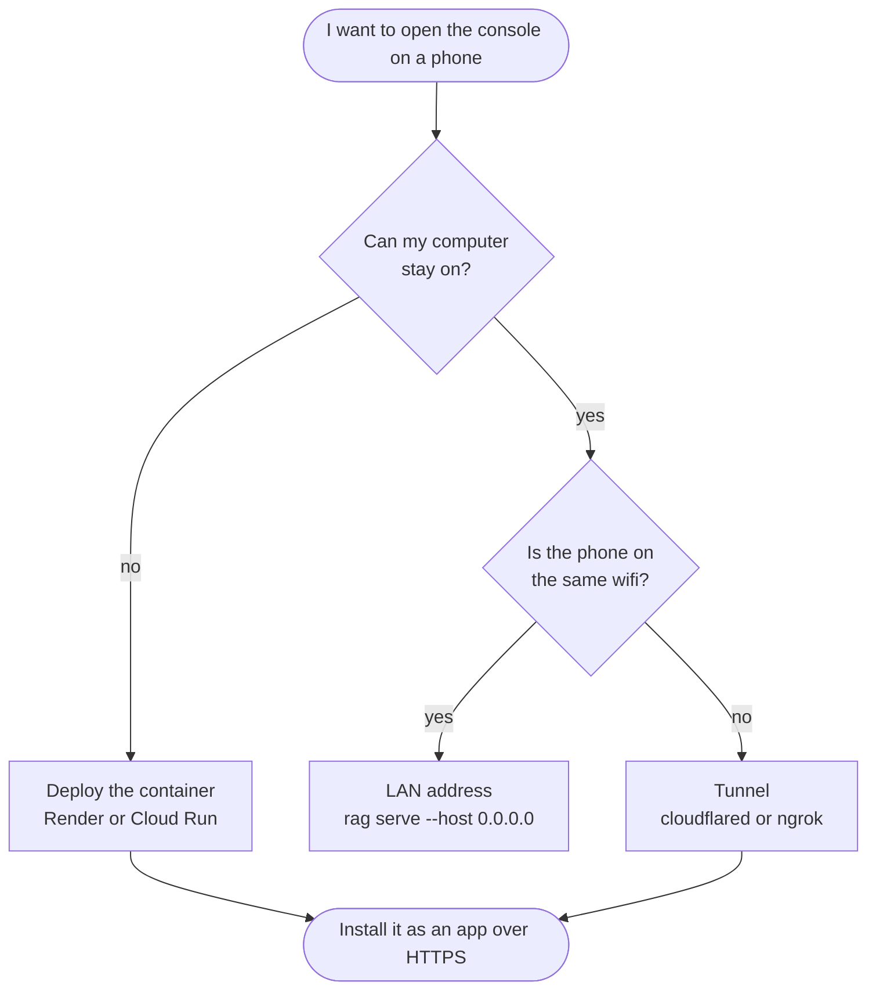
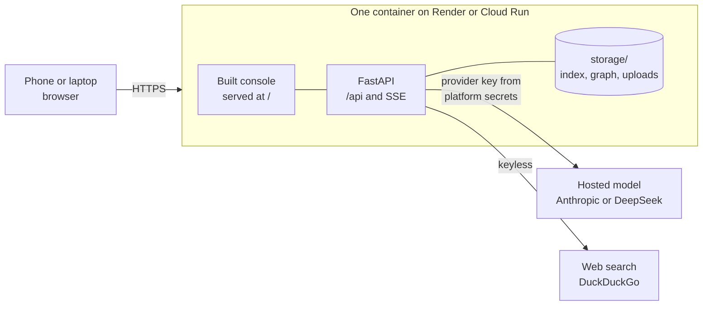

# Deployment and mobile access

[](../Dockerfile)
[](https://render.com)
[](https://cloud.google.com/run)
[](https://developers.cloudflare.com/cloudflare-one/connections/connect-networks/)
[](../frontend/public/manifest.webmanifest)

Two questions with different answers.

1. **Can I show this on my phone without deploying?** Only while your computer is on and reachable.
2. **What do I need for a link that works anywhere, any time?** A deployment. This page covers both.

## The honest answer about phones

A tunnel or a LAN address just forwards traffic to the machine actually running the app. Close the laptop and the demo dies with it.

| Setup | Computer off | On mobile data, away from home | Cost |
| --- | --- | --- | --- |
| LAN address (`rag serve --host 0.0.0.0`) | no | no, same wifi only | free |
| Tunnel (cloudflared, ngrok) | no | yes, while the machine runs | free |
| Deployed container | yes | yes | free tier available |

So if the point is pulling out your phone in a cafe and showing someone, you need a deployment. The tunnel is still worth knowing for quick checks at your desk.



## What this app needs from a host

- **A long-running process**, not short-lived functions. Threads fan out for parallel branches and a background worker feeds the event stream.
- **Streaming responses** held open for the length of an answer.
- **A little disk**, for the index and anything uploaded.
- **About 400 MB of memory** in a normal demo configuration.



Anything that runs a container and keeps it alive works. Serverless function platforms fight every one of those points, which is why **Vercel is the wrong tool here**: functions time out mid-stream, each invocation starts with a cold filesystem, and uploads do not survive. You could host `frontend/dist` there and put the backend elsewhere, but then you are running two platforms for one small app.

## Free options, as of this writing

Free tiers move constantly. Two changed recently: Hugging Face now bills Docker Spaces, and Koyeb closed its free service tier. Check current terms before committing.

| Platform | Free terms | Card needed | Trade-off |
| --- | --- | --- | --- |
| **Render** | one web service, 512 MB, 750 hours a month | no | sleeps after 15 minutes idle, roughly a minute to wake |
| **Google Cloud Run** | 2M requests and 180k vCPU-seconds a month | yes | scales to zero, fast wake, most generous quota |
| Oracle Cloud Always Free | small always-on VM | yes | you run the server yourself |
| Railway | trial credit, then about a dollar a month | yes | fine for a week, not sustainable |
| Hugging Face Spaces | Docker Spaces are paid now | n/a | static Spaces stay free, which will not host the backend |

**Recommendation: Render** if you want no credit card and the simplest path, **Cloud Run** if you want it to feel instant and do not mind adding a card. 750 hours is about 31 days, so one Render service can stay up all month within the free allowance.

### About the sleep on Render

Free services stop after 15 minutes of no traffic and take around a minute to wake. That is the difference between a smooth demo and a minute of silence while someone watches you. Two ways around it:

- Ping `/api/health` every 10 minutes from a free scheduler (cron-job.org, UptimeRobot). This keeps the container warm and stays inside the 750 hours.
- Or open the link yourself a minute before you show anyone.

## Before you deploy: the provider question

This is the part that catches people out.

A **private or internal endpoint only resolves from inside the network that hosts it.** If your `ANTHROPIC_BASE_URL` points at an internal gateway, it will work perfectly on your work machine and fail on Render or Cloud Run, because the deployed container is on the public internet with no route to it. Nothing is wrong with your configuration, the address simply does not exist out there.

For a public demo you need a provider reachable from anywhere:

- A direct Anthropic API key, or
- A DeepSeek key, which is the cheaper option and is supported natively.

Ollama is not an option on a free tier: the model alone is several gigabytes.

Set these as environment variables on the platform, never in the repository:

```text
LLM_PROVIDER=deepseek
DEEPSEEK_API_KEY=your-key
LLM_MODEL_FAST=deepseek-chat
LLM_MODEL_DEEP=deepseek-reasoner
SEARCH_PROVIDER=ddgs
PDF_VISION=off
```

`PDF_VISION=off` matters on a small instance: rendering page images costs memory and one model call per page, which is not what you want a public demo doing on someone else's tap.

If you want the demo private, set `API_AUTH_TOKEN` too, and note the browser console will then need that token, so the simplest honest setup for a public link is no token, the bundled sample corpus, and a spending limit on the provider account.

## Render, step by step

1. Push the repository to GitHub.
2. On [render.com](https://render.com): **New**, **Web Service**, connect the repo.
3. Runtime: **Docker**. Render reads the `Dockerfile` as it is, which already builds the console and pre-indexes the sample corpus.
4. Instance type: **Free**.
5. **Environment**: add the provider variables above.
6. **Create Web Service**. First build takes a few minutes.
7. You get `https://<name>.onrender.com`. Open it on your phone.
8. Optional: **Add Disk**, mount path `/app/storage`, 1 GB, so uploaded documents survive a restart. Disks are a paid feature, and without one the bundled corpus still works because it is baked into the image.

Check `https://<name>.onrender.com/api/health` first. It reports every component, so if the model backend is misconfigured you see exactly that rather than guessing.

## Google Cloud Run, step by step

```bash
gcloud auth login
gcloud config set project <your-project>

gcloud run deploy agentic-rag \
  --source . \
  --region europe-west1 \
  --allow-unauthenticated \
  --memory 1Gi \
  --timeout 900 \
  --set-env-vars LLM_PROVIDER=deepseek,LLM_MODEL_FAST=deepseek-chat,LLM_MODEL_DEEP=deepseek-reasoner \
  --set-secrets DEEPSEEK_API_KEY=deepseek-key:latest
```

`--timeout 900` matters: the default would cut a streaming answer short. Put the key in Secret Manager rather than an environment variable, which is what `--set-secrets` does.

## The quick tunnel, for demos at your desk

```powershell
cd frontend; npm install; npm run build; cd ..
rag serve
```

In a second terminal:

```powershell
cloudflared tunnel --url http://localhost:8000
```

It prints a public `https://` address that works on your phone over mobile data, for as long as your machine stays on. `ngrok http 8000` does the same. Set `API_AUTH_TOKEN` first if you leave it up for more than a moment, and stop the tunnel when you are done.

Same wifi and no tunnel at all:

```powershell
rag serve --host 0.0.0.0 --port 8000
```

Then open `http://<your-lan-ip>:8000` on the phone. Allow the Windows firewall prompt for private networks.

## Install it on the phone

Once the console is on HTTPS, the browser offers to install it:

- **Android, Chrome**: menu, "Add to Home screen".
- **iPhone, Safari**: share button, "Add to Home Screen".
- **Desktop Chrome or Edge**: the install icon at the right of the address bar.

It then opens full screen with no browser chrome, which demos far better than a tab. The console is built for small screens: history collapses into a drawer, answers use the full width, and the evidence panel becomes a full-screen sheet.

Plain `http://` on a LAN address works for viewing, but installing needs HTTPS, so use a tunnel or the deployed URL.

## Cost control

With a hosted provider you pay per question. For a demo on the bundled corpus that is small change, but before sharing a public link:

- Set a spending limit in the provider dashboard.
- Use the two-tier routing so planning and judging run on the cheap model.
- Keep `PDF_VISION=off` unless a demo needs it.
- Consider `MAX_BRANCHES=1` on a public link, which stops one question from fanning out into several model calls.
