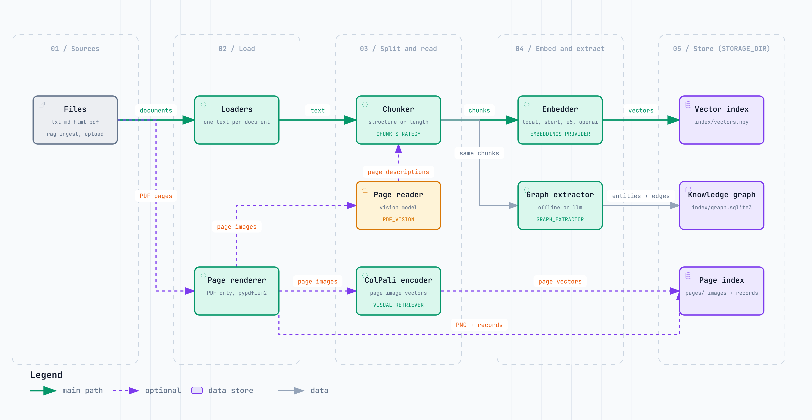
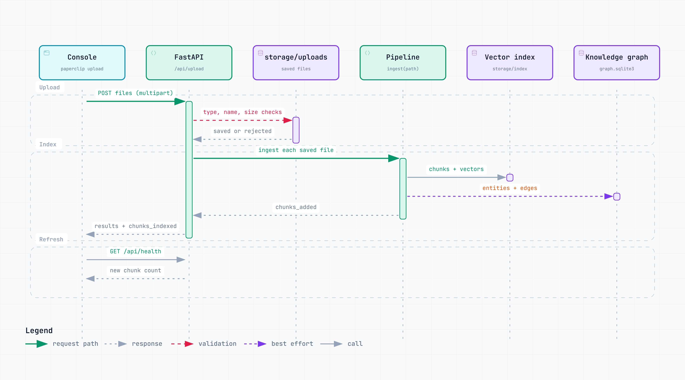

# Ingestion

How files become chunks, vectors, graph edges, and page images under `STORAGE_DIR`.

Code: `AgenticRAG.ingest` in `src/agentic_rag/pipeline.py`, plus `src/agentic_rag/ingestion/`.

## The data path

<picture>
  <source media="(prefers-color-scheme: dark)" srcset="diagrams/ingest.dataflow.dark.png">
  
</picture>

<sub>Interactive version: [`diagrams/ingest.dataflow.html`](diagrams/ingest.dataflow.html).</sub>

For every file under the given path (subfolders included):

1. **Load.** `ingestion/loaders.py` reads `.txt`, `.md`, `.markdown`, `.html`, `.htm`, and `.pdf` into
   one text per document. A file that cannot be read is reported and skipped; the rest of the batch
   continues.
2. **Skip known files.** A document's id is a hash of its resolved file path, so ingesting the same
   path again is a no-op. A changed file at the same path is not re-read; a copy at a new path is a
   new document.
3. **Chunk.** `CHUNK_STRATEGY=structure` (default) keeps headings and sentences intact;
   `length` is a fixed window. Targets come from `CHUNK_TARGET_CHARS` (900) and
   `CHUNK_OVERLAP_CHARS` (150).
4. **Page images (PDF only).** See [below](#pdfs-that-carry-their-meaning-in-pictures).
5. **Embed and store.** `EMBEDDINGS_PROVIDER` (`local`, `sbert`, `multilingual`, `openai`) embeds the
   chunks into the NumPy vector store.
6. **Extract the graph.** With `GRAPH_EXTRACTION` on (the default), the same chunks feed the
   [knowledge graph](knowledge-graph.md). A failure here never fails the ingest: a failing chunk is
   skipped and counted, a failing document is reported, and the document stays in the index.
   `rag graph rebuild` is the recovery path.

### What lands where

| Path under `STORAGE_DIR` (default `storage/`) | Written by |
|---|---|
| `index/vectors.npy`, `index/chunks.jsonl`, `index/manifest.json` | The vector store |
| `index/graph.sqlite3` | The SQLite graph store (`GRAPH_STORE=sqlite`) |
| `pages/` and `pages/images/` | Page records and rendered PNGs, when page images are on |
| `uploads/` | Files uploaded through the console or `/api/upload` |

The manifest records which embedder built the index, and the store refuses to mix vectors from
another one. After changing `EMBEDDINGS_PROVIDER`, run `rag reindex`, which re-embeds the stored
chunks without needing the source files and keeps chunk ids stable.

## Uploading through the console

<picture>
  <source media="(prefers-color-scheme: dark)" srcset="diagrams/upload-ingest.sequence.dark.png">
  
</picture>

<sub>Interactive version: [`diagrams/upload-ingest.sequence.html`](diagrams/upload-ingest.sequence.html).</sub>

`POST /api/upload` takes multipart files. Each one is checked before anything is written:

- the extension must be a supported type,
- the file name is reduced to a bare, safe name and must resolve inside `storage/uploads/`,
- the size must stay under `UPLOAD_MAX_MB` (25); an oversized file is deleted as soon as it crosses
  the limit.

An existing name gets a `-1`, `-2` suffix rather than being overwritten. Every saved file is then
ingested as above, and the response lists each file as `saved` or `rejected` with the reason. See the
[API reference](api.md#post-apiupload).

`POST /api/ingest` instead reads a path on the server, limited to the folders in `INGEST_ROOTS`
(default `data`) and the uploads folder. The `rag ingest` CLI has no such limit.

## PDFs that carry their meaning in pictures

Text extraction gets the prose and loses charts, schematics, and tables whose layout carries the
meaning. `data/sample_pdfs/auralis-quarterly-review.pdf` shows it: its quarterly figures exist only
as bar heights, and a test asserts that text extraction does not find them.

Pages are rendered once (`pip install -e ".[vision]"` adds the renderer) and can be used two ways.

**Descriptions (`PDF_VISION`, default `auto`).** A vision-capable model describes each page, and the
description is indexed as an ordinary chunk headed "page N (visual)". `off` never does this, `on`
always does, and `auto` is meant to do it only when text extraction came back thin (under 220
characters per page). It only runs when the active model can read images.

> Known issue: `pipeline.py` counts pages by form-feed characters, but `loaders.py` joins PDF pages
> with blank lines, so the page count is always 1 and `auto` compares the whole document's text
> against 220 characters. In practice `auto` describes only PDFs with almost no extractable text. Up to `VISION_MAX_PAGES` (20)
pages are rendered at `VISION_SCALE` (2.0).

**ColPali (`VISUAL_RETRIEVER=colpali`).** Page images are embedded directly, one vector per patch, and
ranked by late interaction (MaxSim). This needs `pip install -e ".[colpali]"` (colpali-engine and
torch). `COLPALI_MODEL` blank uses colSmol, the CPU-friendly model. The maths is plain NumPy in
`retrieval/late_interaction.py`, and `retrieval/colpali.py` is the only file that imports torch.

Both paths write into the same page index, and the `visual_search` tool is registered only once pages
are indexed. When a retrieved page reaches synthesis and the answering model can see, the page image
itself is attached to the prompt.

| | `PDF_VISION` descriptions | `VISUAL_RETRIEVER=colpali` |
|---|---|---|
| Extra install | page renderer, small | colpali-engine and torch, large |
| Hardware | none | CPU works with colSmol |
| Cost | one model call per page at ingest | one forward pass per page, then per query |
| Fits a 512 MB free hosting tier | yes | no |

## Commands

```bash
rag ingest data/sample_docs     # index a folder
rag reindex                     # re-embed stored chunks after changing the embedder
rag graph rebuild               # rebuild the knowledge graph from stored chunks
rag stats                       # what the pipeline resolved and how much is indexed
```
