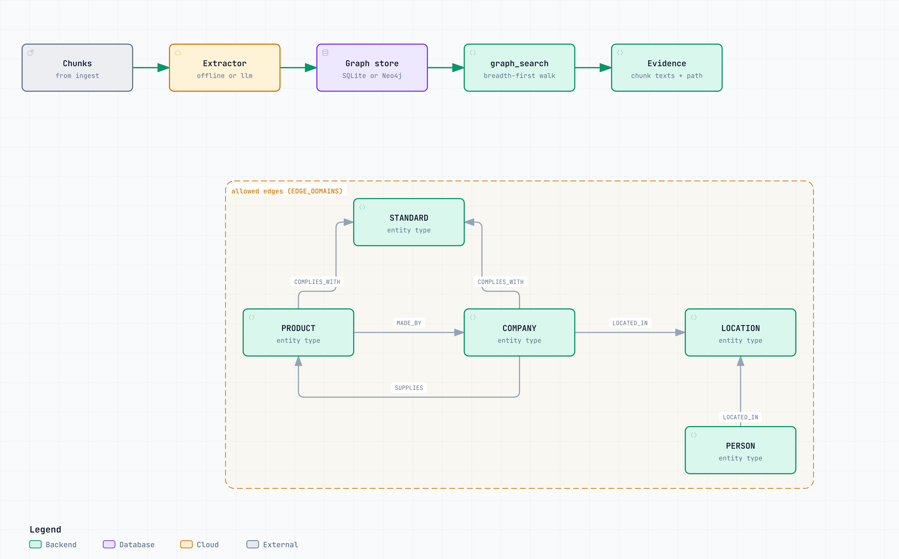

# The knowledge graph

A graph of what the documents are about, so a question whose answer is not written in any single
passage can be answered by following relationships instead of ranking similarity.

Code: `src/agentic_rag/kg/` and `src/agentic_rag/tools/graph_search.py`. The pipeline attribute is
`knowledge_graph`. This is unrelated to `agentic_rag.graph`, the [orchestrator](agent.md).

<picture>
  <source media="(prefers-color-scheme: dark)" srcset="diagrams/knowledge-graph.architecture.dark.png">
  
</picture>

<sub>Interactive version: [`diagrams/knowledge-graph.architecture.html`](diagrams/knowledge-graph.architecture.html).</sub>

## Why it exists

The corpus says the Atlas P2 is made by Auralis Dynamics, that Auralis Dynamics is in Munich, and that
the Atlas platform is certified to ISO 3691-4:2023. Three documents, three facts, no passage holding
more than one of them. Ask which standard applies to the robot from the Munich company and similarity
search has nothing to rank.

```text
$ rag graph explain "Which safety standard applies to the robot made by the company headquartered in Munich?" --hops 3

SEEDS
  Munich (LOCATION)

PATH (3 hop max)
  hop 1: Auralis Dynamics -[LOCATED_IN]-> Munich
  hop 2: Atlas P2 -[MADE_BY]-> Auralis Dynamics
  hop 3: Atlas P2 -[COMPLIES_WITH]-> ISO 3691-4:2023
```

`tests/test_knowledge_graph.py::test_traversal_retrieves_answers_similarity_search_misses` compares
what each path retrieves. A single fact in one passage stays on `vector_search`.

## Schema

Five entity types and four edge types (`kg/schema.py`), small enough for an offline extractor to fill
reliably.

| Entity type | Example |
|---|---|
| `COMPANY` | Auralis Dynamics, SAP |
| `PRODUCT` | Atlas P2, Atlas Hive |
| `PERSON` | Bernd Montag |
| `STANDARD` | ISO 3691-4:2023, GDPR, SOC 2 Type II |
| `LOCATION` | Munich, Walldorf |

| Edge | From | To |
|---|---|---|
| `MADE_BY` | PRODUCT | COMPANY |
| `SUPPLIES` | COMPANY | COMPANY, PRODUCT |
| `COMPLIES_WITH` | PRODUCT, COMPANY | STANDARD |
| `LOCATED_IN` | COMPANY, PERSON | LOCATION |

Edges are checked against those pairs (`EDGE_DOMAINS`), so a cue word cannot produce a location that
complies with a standard. Every edge keeps the chunk and sentence it came from.

## Extraction

`GRAPH_EXTRACTOR` picks the extractor (`kg/extractors.py`):

- `offline` is patterns and rules, with no key, network, or cost. Standards come from their number
  format, companies from corporate suffixes, products from model codes, people from titles, locations
  from prepositions. Every edge needs a cue word between the two mentions.
- `llm` asks the configured model for JSON per chunk. It reads far more than patterns can and costs one
  model call per chunk. An unparseable reply falls back to the offline rules for that chunk.
- `auto` (default) uses `llm` only when `LLM_PROVIDER` is set to something other than `auto` or
  `mock`, so a plain `rag ingest` never starts spending model calls because Ollama happened to be
  running.

Entities per chunk are capped by `GRAPH_MAX_ENTITIES_PER_CHUNK` (12). `GRAPH_EXTRACTION=false` turns
extraction off.

### Entity resolution, and what it does not do

Names are normalised (case, whitespace, Unicode NFKC) and looked up in an exact-match alias table,
`data/graph_aliases.json` (`GRAPH_ALIAS_PATH`), in the format
`{"surface form": ["Canonical Name", "TYPE"]}`. That is all of it:

- no fuzzy or embedding matching: "Auralis Dynamic" and "Auralis Dynamics" stay two nodes unless an
  alias joins them,
- no coreference: "the company" in a later sentence links to nothing,
- no disambiguation: two companies with one name become one node,
- the offline extractor leans on capitalisation, so non-Latin chunks mostly yield standards and alias
  hits.

## graph_search

The tool links the question to seed entities, walks breadth-first out to `GRAPH_HOPS` (2) hops (the
planner can ask for up to 4) and at most 40 entities, and returns the traversed path plus the chunks
the walked edges came from, so answers stay cited to source text. It is offered to the planner only
once the graph holds edges.

## Storage and operations

SQLite by default, in `storage/index/graph.sqlite3` next to the vector index. Writes are idempotent per
document. Every read and write goes through one re-entrant lock, because parallel branches share the
connection.

`GRAPH_STORE=neo4j` with `pip install -e ".[neo4j]"` selects the optional Neo4j backend
(`NEO4J_URI`, `NEO4J_USER`, `NEO4J_PASSWORD`, `NEO4J_DATABASE`). No test or default run touches it.

```bash
rag graph stats                  # entity and relationship counts by type
rag graph rebuild                # rebuild from stored chunks, no source files needed
rag graph explain "<question>"   # the seeds and every hop walked
rag eval --golden eval/golden_set_graph.jsonl
```

Graph building never breaks ingest: a chunk the extractor fails on is skipped and counted, a failing
document is reported, and the documents still land in the index. After
`GRAPH_MAX_CONSECUTIVE_FAILURES` (5) failures in a row, extraction for that document stops.
