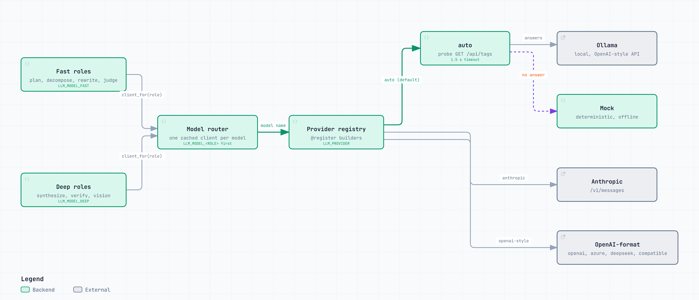

# Models and providers

One variable switches the backend, and the pipeline is identical across all of them.

Code: `src/agentic_rag/llm/` (`providers.py`, `router.py`, `ollama.py`, `mock.py`).

<picture>
  <source media="(prefers-color-scheme: dark)" srcset="diagrams/models.architecture.dark.png">
  
</picture>

<sub>Interactive version: [`diagrams/models.architecture.html`](diagrams/models.architecture.html).</sub>

## Providers

`llm/providers.py` is a small registry: each backend is one builder function tagged
`@register("name")`, chosen by `LLM_PROVIDER`. Clients are built lazily, so a missing key for an unused
provider cannot break anything.

| `LLM_PROVIDER` | Needs | Model setting |
|---|---|---|
| `auto` (default) | nothing | Ollama when it answers at `OLLAMA_BASE_URL`, otherwise the mock |
| `ollama` | a running Ollama | `OLLAMA_MODEL`, blank picks one (see below) |
| `anthropic` | `ANTHROPIC_API_KEY` | `ANTHROPIC_MODEL`, default `claude-sonnet-4-6` |
| `openai` | `OPENAI_API_KEY` (required for api.openai.com) | `OPENAI_MODEL`, default `gpt-4o-mini` |
| `azure` | `AZURE_OPENAI_ENDPOINT`, `AZURE_OPENAI_DEPLOYMENT`, `AZURE_OPENAI_API_KEY` | the deployment |
| `deepseek` | `DEEPSEEK_API_KEY` | `DEEPSEEK_MODEL`, default `deepseek-flash` |
| `openai_compatible` | `OPENAI_BASE_URL` (vLLM, LM Studio, gateways), `OPENAI_API_KEY` only if the endpoint wants one | `OPENAI_MODEL` |
| `mock` | nothing | deterministic offline answers for tests and CI |

`LLM_MODEL`, when set, wins over the provider-specific model setting, so one variable covers every
backend. The name is sent through untouched, because private endpoints often serve names the public
APIs do not; `rag models` asks the endpoint what it serves and flags whether your setting is on the
list. `ANTHROPIC_BASE_URL` and `OPENAI_BASE_URL` point a provider at a private or self-hosted endpoint,
and `LLM_EXTRA_HEADERS` (JSON) adds headers a gateway needs.

```bash
# .env, Claude
LLM_PROVIDER=anthropic
ANTHROPIC_API_KEY=<YOUR_API_KEY>
LLM_MODEL=claude-sonnet-4-6
```

**Ollama auto-pick.** With `OLLAMA_MODEL` blank, the client takes the first installed model that
matches a fixed preference list ordered by how reliably models follow the JSON planning protocol
(`qwen2.5:14b`, `qwen2.5:7b-instruct`, then other qwen, llama, mistral, phi, and gemma tags), and
otherwise the first installed model. `ollama pull qwen2.5:7b-instruct` is the recommended start.

**Setup failures are readable.** A missing key, a rejected credential, a model the endpoint does not
have, or a model that refuses `temperature` becomes a `ProviderError` that names the fix, and the API
returns that message instead of a 500. `LLM_TEMPERATURE=` (blank) leaves the field out for models that
reject it. Verifying, judging, splitting, and rewriting always run at `0.0`.

## One model per job

A run uses the model in seven roles: `plan`, `decompose`, `rewrite`, `synthesize`, `verify`,
`judge`, and `vision`. `llm/router.py` resolves each role, most specific first:

1. `LLM_MODEL_<ROLE>`, for example `LLM_MODEL_JUDGE`,
2. `LLM_MODEL_FAST` for the fast roles (`plan`, `decompose`, `rewrite`, `judge`) or `LLM_MODEL_DEEP`
   for the rest,
3. `LLM_MODEL`.

```bash
LLM_MODEL_FAST=deepseek-flash      # plan, decompose, rewrite, judge
LLM_MODEL_DEEP=deepseek-v4-pro     # synthesize, verify, vision
```

Clients are cached per model name, so roles on the same model share one client and a single-model
setup builds exactly one. `rag stats` and `/api/health` show the resolved map when more than one model
is in play.

## The mock

`llm/mock.py` speaks the same JSON protocol as a real model, deterministically. It is what keeps
`pytest`, `rag eval`, and CI working with no network and no keys, and `LLM_PROVIDER=auto` always falls
back to it when Ollama is absent. It never decomposes a question, and it answers by quoting the
retrieved sentence that best overlaps the question.

Its contract is load-bearing: the MODE markers in system prompts, the `OBSERVATION {i} ({tool}):`
format in the orchestrator, and the `END OF SOURCES` terminator in synthesis prompts must change
together with `mock.py`.

## Checking a real model

```bash
rag stats                              # which LLM and embedder resolved
rag models                             # what the configured endpoint serves
python scripts/smoke_language.py       # a German question end to end, reports the answer language
```

`smoke_language.py` exit codes: 0 answered in German, 1 another language, 2 the provider is not
configured, 3 the index is empty.
