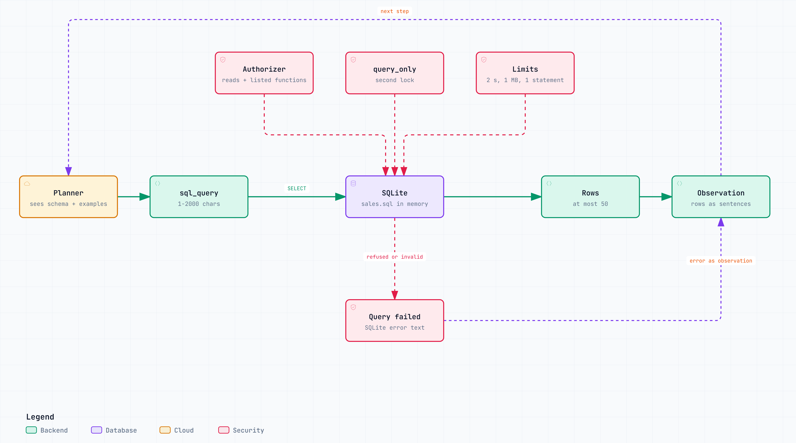

# Text-to-SQL

Some questions are about records, not passages: which customer ordered the most robots, how many
orders are still open. Retrieval ranks text and cannot count or add up rows, so `sql_query` lets the
planner ask a database directly.

Code: `src/agentic_rag/tools/sql.py`. Sample data: [`data/structured/sales.sql`](../data/structured/sales.sql)
(fictional customers and orders).

<picture>
  <source media="(prefers-color-scheme: dark)" srcset="diagrams/text-to-sql.architecture.dark.png">
  
</picture>

<sub>Interactive version: [`diagrams/text-to-sql.architecture.html`](diagrams/text-to-sql.architecture.html).</sub>

## How it works

- **The planner writes the SQL.** The schema and the worked examples are part of the tool description,
  so they sit next to the question in the planning prompt. There is no separate text-to-SQL model call.
- **Errors come back as advice.** A failing query returns SQLite's own message as the observation, and
  the planner fixes the query on its next step.
- **Every number can be rerun.** The evidence's source reference is the query itself.
- **Your own data.** `SQL_DATABASE_PATH` takes a `.sql` script, which is loaded into an in-memory
  database so nothing is written to disk, or a `.db`, `.sqlite`, or `.sqlite3` file, which is opened
  read-only in place (`mode=ro`). In a `.sql` script, `-- Q:` and `-- SQL:` comment pairs become the
  worked examples. A blank value turns the tool off.

```text
$ rag ask "Which customer has ordered the most robots in total?" --trace

-- ANSWER --------------------------------------------------------------
Database query result: name Nordlicht Logistik, robots ordered 32. [1]
```

That is the offline mock, which quotes the row as it came back. A real model writes a sentence
around it.

## Read-only is enforced by SQLite

Safety never depends on reading the SQL text, because text filters are easy to talk around:

| Attempt | What stops it |
|---|---|
| `DELETE`, `UPDATE`, `INSERT`, `CREATE`, `DROP` | An authorizer that allows `SELECT` and `READ` and nothing else |
| `ATTACH DATABASE`, `PRAGMA` | The same authorizer, plus a `query_only` connection |
| `SELECT 1; DROP TABLE orders` | `execute()` runs exactly one statement |
| `randomblob(900000000)`, `printf`, `load_extension` | Functions must be on an allowlist of aggregate, math, text, and date functions |
| One enormous string, such as `group_concat` over a huge join | A 1 MB cap per value (`SQLITE_LIMIT_LENGTH`, Python 3.11 and later) |
| A query that never ends | A progress handler that interrupts it after 2 seconds |
| A result with a million rows | At most 50 rows come back |
| A query longer than 2000 characters | Rejected before it runs |

One connection serves every branch, and SQLite connections are not safe to share across threads, so
queries go through a lock.

## Offline behaviour

The mock cannot write SQL. It runs the worked example a question closely matches: at least two shared
content words, covering at least 60% of the example's words. That keeps the three database questions
in the golden set deterministic.

## Limits

SQLite only, one statement per call. Recursive CTEs and functions outside the allowlist are refused
along with writes. On Python 3.10 the 1 MB value cap is not available; the allowlist and the time limit
still apply.
